# Titanic Survival
January 37, 2016  
#### Titanic Survival Prediction
*One* Approach to Deriving a Model

----------------------------
###Disclaimer
The following describes an approach I took to the [Titanic survival prediction challenge](http://www.kaggle.com/c/titanic-gettingStarted) presented by [Kaggle](http://www.kaggle.com).  By no means does this approach represent a comprehensive, exhaustive pursuit of the best model for predicting Titanic passenger survival based on data provided by Kaggle.  The intent here is merely to demonstrate utilization of some of the tools of the data science trade.  

### Use of R
This entire analysis, [soup to nuts](http://en.wikipedia.org/wiki/Soup_to_nuts), will utilize the [R software environment](http://www.r-project.org/).  Many would rightfully argue that there are better tools for portions (e.g. [munging](http://en.wikipedia.org/wiki/Data_wrangling)) of the journey to a fitted model. I sought to demonstrate here that, for those who do tend to lean on R or who wish to learn R, an all-R solution is possible.

V1 - results were .77 prior to LR changes

### Background
One could hypothesize from stories of the Titanic's sinking that a passenger's survival was heavily dependent upon two factors:
1. Recognition of the possibility that the ship could sink
2. Access to a lifeboat 

[According to Wikipedia](http://en.wikipedia.org/wiki/RMS_Titanic), the Titanic reportedly struck an iceberg at 11:40 pm ship's time.  The majority of its 2,224 passengers and crew had likely retired to their respective cabins for the evening by that time.  Those on the upper decks had a shorter journey to the lifeboats, and possibly access to more timely and accurate information about the impending threat.  Thus, any data relating to one's location on the ship could prove helpful to survival predictions.  Below is a cross-section of the Titanic:


The Titanic was designed to carry 32 lifeboats, but this number was reduced to 20 (enough for about 1,180 people) for its maiden voyage -- likely a cost-cutting measure influenced by perceptions that the additional boats would clutter the deck of a ship deemed "unsinkable."  Given that constraint, it is not surprising that a disproportionate number of men were apparently left aboard because of a [women and children first](http://en.wikipedia.org/wiki/Women_and_children_first) protocol followed by some of the officers overseeing the loading of lifeboats with passengers.

### Getting the Data Into R
Kaggle packaged the data for the Titanic challenge into two csv-format files:
- **train.csv** (data containing attributes and known outcomes [survived or perished] for a subset of the passengers)
- **test.csv** (data containing attributes *without* outcomes for a subset of passengers)

I've reviewed a *lot* of code containing approaches to sourcing data from a csv file with R.  The majority seem to go no further than a simple read.csv function, mostly devoid of options, coded separately for each file being read. Later, the user often finds her/himself manually doing a number of tasks that could have been handled within the read function call.  I chose to get as much out of ``` read.csv``` as I could in the context of a re-usable custom function.

```r
setwd("~/GitHub/Titanic")
readData <- function(path.name, file.name, column.types, missing.types) {
  read.csv( url( paste(path.name, file.name, sep="") ), 
            colClasses=column.types,
            na.strings=missing.types )
}
```
I've pushed the [Titanic csv files](https://github.com/wehrley/Kaggle_Titanic) to my GitHub account so that I can access the data from anywhere and, more importantly, demonstrate here the reading of data from a web source.  Here are the arguments I will pass into this custom file reading function for the train.csv file:

```r
Titanic.path <- "https://raw.github.com/wehrley/Kaggle_Titanic/master/"
train.data.file <- "train.csv"
test.data.file <- "test.csv"
missing.types <- c("NA", "")
train.column.types <- c('integer',   # PassengerId
                        'factor',    # Survived 
                        'factor',    # Pclass
                        'character', # Name
                        'factor',    # Sex
                        'numeric',   # Age
                        'integer',   # SibSp
                        'integer',   # Parch
                        'character', # Ticket
                        'numeric',   # Fare
                        'character', # Cabin
                        'factor'     # Embarked
)
test.column.types <- train.column.types[-2]     # # no Survived column in test.csv
```
Specifying missing types up front should make the data munging process a bit easier, and while I may have to change the class type for a data frame column or two along the way, I've specified class definitions in a manner which should be most conducive to modeling later.  This leaves me with much cleaner code for reading the csv files.

```r
train.raw <- readData(Titanic.path, train.data.file, 
                      train.column.types, missing.types)
df.train <- train.raw

test.raw <- readData(Titanic.path, test.data.file, 
                     test.column.types, missing.types)
df.infer <- test.raw   
```
### Data Munging
Josh Wills, senior director of data science at [Cloudera](http://www.cloudera.com/), described himself as a *data janitor* in [this interview](http://www.technologyreview.com/news/513866/in-a-data-deluge-companies-seek-to-fill-a-new-role/) from spring 2013.  My experience in analytics projects over the years has certainly confirmed that data preparation accounts for the bulk of the effort.  While some consider the process of getting data into an analysis-ready form as a sort of necessary evil, I've often derived value from "getting one's hands dirty" and acquiring a granular view of the available data.  Sometimes my greatest insights have come from this phase, often referred to as data pre-processing. 

Let's start with a look at missing data in the training set.  I'll use the ```missmap ``` function from the [Amelia package](http://cran.r-project.org/web/packages/Amelia/) to display those. 

```r
library(Amelia)
```

```
## Warning: package 'Amelia' was built under R version 3.2.3
```

```
## Loading required package: Rcpp
## ## 
## ## Amelia II: Multiple Imputation
## ## (Version 1.7.4, built: 2015-12-05)
## ## Copyright (C) 2005-2016 James Honaker, Gary King and Matthew Blackwell
## ## Refer to http://gking.harvard.edu/amelia/ for more information
## ##
```

```r
## map missing data by provided feature
require(Amelia)
missmap(df.train, main="Titanic Training Data - Missings Map", 
        col=c("yellow", "black"), legend=FALSE)
```

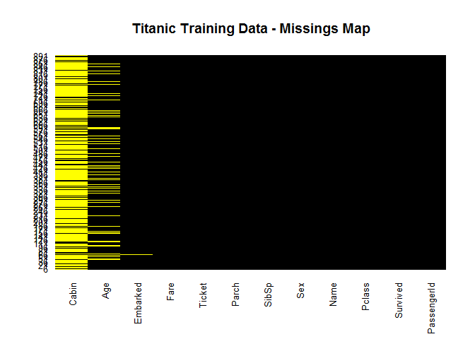 


Roughly 20 percent of the Age data is missing, and well above 70 percent of the passengers cannot be linked to a specific cabin number.  While the proportion of Age "missings" is likely small enough for reasonable replacement with some form of [imputation](http://en.wikipedia.org/wiki/Imputation_%28statistics%29), the cabin missings seem too extensive to make reliable imputation possible.  Nevertheless, *some* data could be better than *zero* data, so I'll look at cabin numbers later to see how we can put them to use. 

Before we start filling in missing data, let's see what can be learned from the data we have.  Putting some simple data visualization tools to work can take us a long way toward understanding what might influence the outcome we're trying to predict -- in this case, whether or not a passenger survived.  Below is some code and the graphs they produced:

```r
barplot(table(df.train$Survived),
        names.arg = c("Perished", "Survived"),
        main="Survived (passenger fate)", col="black")
```

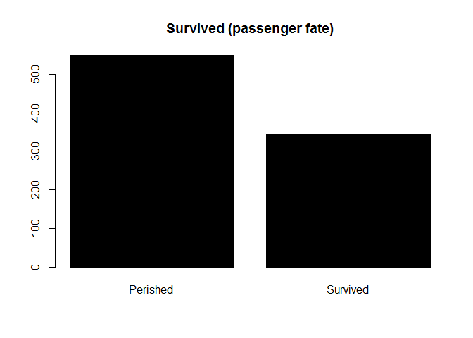 

```r
barplot(table(df.train$Pclass), 
        names.arg = c("first", "second", "third"),
        main="Pclass (passenger traveling class)", col="firebrick")
```

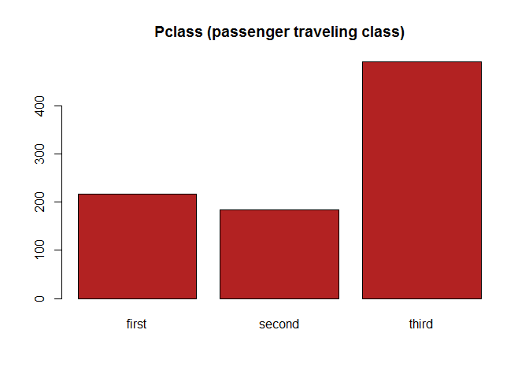 

```r
barplot(table(df.train$Sex), main="Sex (gender)", col="darkviolet")
```

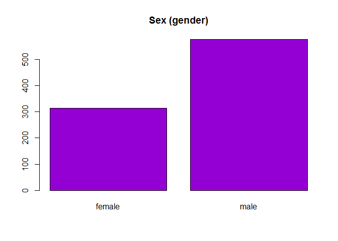 

```r
hist(df.train$Age, main="Age", xlab = NULL, col="brown")
```

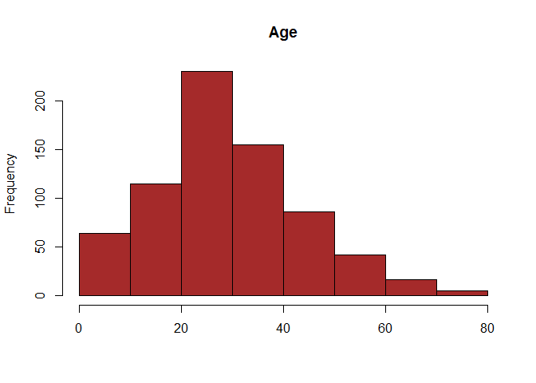 

```r
barplot(table(df.train$SibSp), main="SibSp (siblings + spouse aboard)", 
        col="darkblue")
```

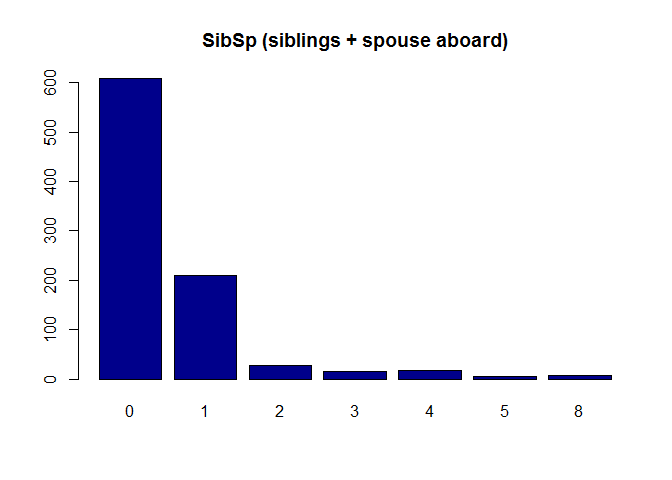 

```r
barplot(table(df.train$Parch), main="Parch (parents + kids aboard)", 
        col="gray50")
```

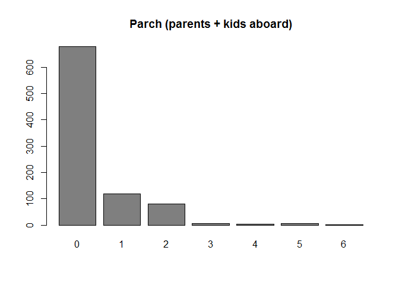 

```r
hist(df.train$Fare, main="Fare (fee paid for ticket[s])", xlab = NULL, 
     col="darkgreen")
```

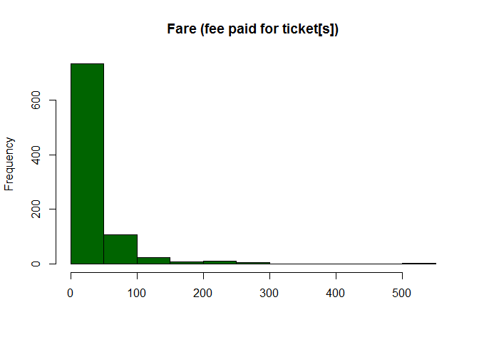 

```r
barplot(table(df.train$Embarked), 
        names.arg = c("Cherbourg", "Queenstown", "Southampton"),
        main="Embarked (port of embarkation)", col="sienna")
```

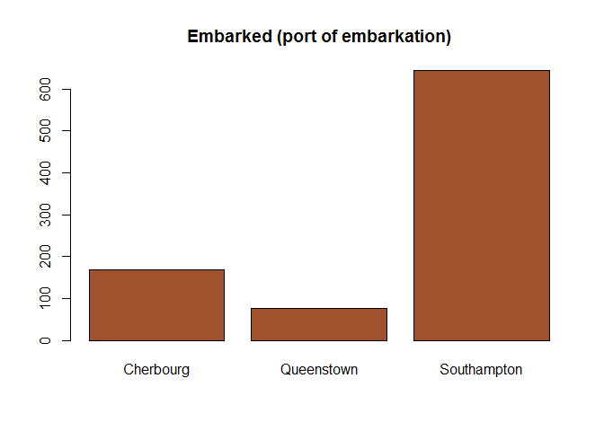 


Note the dominant categories in the first three graphs:
* more passengers perished than survived
* about twice as many passengers in 3rd class than in either 1st or 2nd
* male passengers far outnumbered females

Perhaps these are the first clues that the two themes discussed earlier -- women and children first policy, and location on the ship -- could dictate the feature set.
Although the fact that Southampton was the port of embarkation for most passengers doesn't make for a very balanced *Embarked* factor, it might mean something in the final analysis.

Mosaic plots offer an interesting -- and arguably under-utilized -- way to summarize data.  The [vcd package](http://cran.r-project.org/web/packages/vcd/index.html) includes the ``` mosaicplot``` function for creating those.  The following mosaic suggests that traveling class did influence the odds of a passenger's survival.

```r
mosaicplot(df.train$Pclass ~ df.train$Survived, 
           main="Passenger Fate by Traveling Class", shade=FALSE, 
           color=TRUE, xlab="Pclass", ylab="Survived")
```

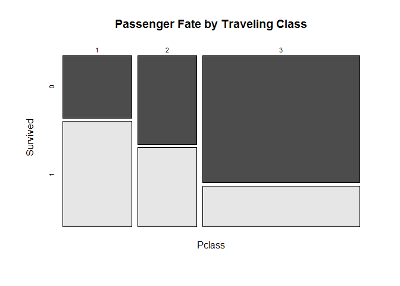 


Do you recall the earlier bar graph showing that some 2/3 of passengers were males?  That is taken into account by the width of the two rectangles labeled "male" in the mosaic below.  Now look at the *height* of the leftmost light gray rectangle [representing the proportion of females who survived] and compare it to the much shorter light gray rectange [representing proportion of males who survived].  Gender should certainly prove to be a prominent feature in the final model.   

```r
mosaicplot(df.train$Sex ~ df.train$Survived, 
           main="Passenger Fate by Gender", shade=FALSE, color=TRUE, 
           xlab="Sex", ylab="Survived")
```

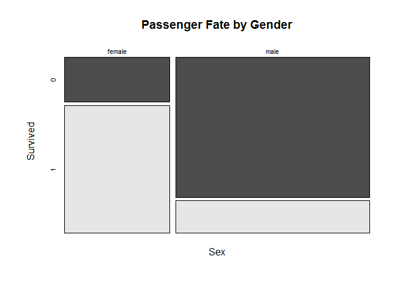 


Is it possible that "survival of the fittest" dictated the fate of passengers in certain parts of the ship?  Perhaps, though it isn't apparent at first glance from the boxplot of Age by Survival.

```r
boxplot(df.train$Age ~ df.train$Survived, 
        main="Passenger Fate by Age",
        xlab="Survived", ylab="Age")
```

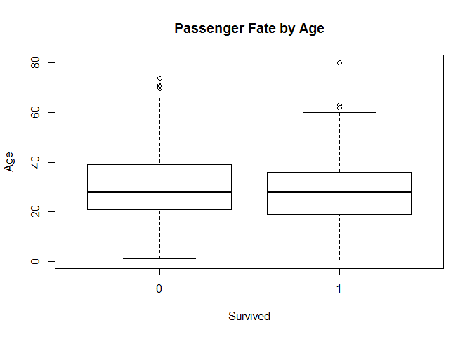 


While passenger survival didn't vary as much across the three ports of embarkation as it did between genders and traveling classes, perhaps the *Embarked* feature will prove useful at some point.  

```r
mosaicplot(df.train$Embarked ~ df.train$Survived, 
           main="Passenger Fate by Port of Embarkation",
           shade=FALSE, color=TRUE, xlab="Embarked", ylab="Survived")
```

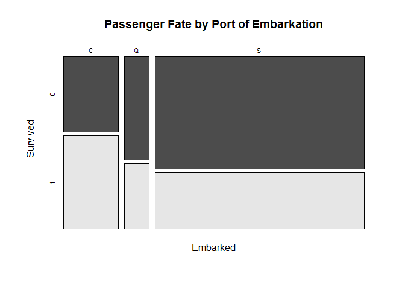 


Just one more graph, then we'll get to those missing ages.  The [corrgram package](http://cran.r-project.org/web/packages/corrgram/) is the source of a function for creating what is sometimes referred to as a correlogram.  The one shown below confirms a couple of observations already made -- namely, that survival odds drop with class, and age may not prove to be a significant predictor.  Given that the upper class ranks tend to be represented by an older demographic, an inverse correlation between age and traveling class is to be expected.  Although fare and class are closely related, it might be worth throwing the **Fare** feature into the mix as another way to define a passenger's location on the ship. 

```r
library(corrgram)
```

```
## Warning: package 'corrgram' was built under R version 3.2.3
```

```r
require(corrgram)
library(plyr) # for revalue
```

```
## Warning: package 'plyr' was built under R version 3.2.3
```

```
## 
## Attaching package: 'plyr'
## 
## The following object is masked from 'package:corrgram':
## 
##     baseball
```

```r
library(ada) # for ada (later)
```

```
## Warning: package 'ada' was built under R version 3.2.3
```

```
## Loading required package: rpart
```

```r
corrgram.data <- df.train
## change features of factor type to numeric type for inclusion on correlogram
corrgram.data$Survived <- as.numeric(corrgram.data$Survived)
corrgram.data$Pclass <- as.numeric(corrgram.data$Pclass)
corrgram.data$Embarked <- revalue(corrgram.data$Embarked, 
                                  c("C" = 1, "Q" = 2, "S" = 3))
## generate correlogram
corrgram.vars <- c("Survived", "Pclass", "Sex", "Age", 
                   "SibSp", "Parch", "Fare", "Embarked")
corrgram(corrgram.data[,corrgram.vars], order=FALSE, 
         lower.panel=panel.ellipse, upper.panel=panel.pie, 
         text.panel=panel.txt, main="Titanic Training Data")
```

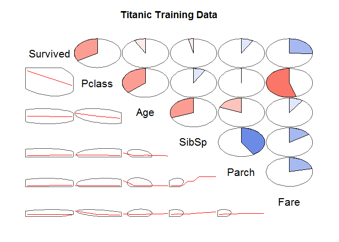 


Time to tackle those missing ages.  A common approach to this type of situation is to replacing the missings with the average of the available values.  In this case, that would mean replacing 177 missing **Age** values with 29.7.

```r
summary(df.train$Age)
```

```
##    Min. 1st Qu.  Median    Mean 3rd Qu.    Max.    NA's 
##    0.42   20.12   28.00   29.70   38.00   80.00     177
```

```r
#   Min. 1st Qu.  Median    Mean 3rd Qu.    Max.    NA's 
#   0.42   20.12   28.00   29.70   38.00   80.00     177 
```
Taking that approach would be fine if only a small fraction of the ages were missing.  However, with missings accounting for 20 percent of all **Age** data in a relatively small data set (<900 records), one could justify a search for a more refined method of imputation.  Let's peek again at the list of currently available features:    

```r
names(df.train)
```

```
##  [1] "PassengerId" "Survived"    "Pclass"      "Name"        "Sex"        
##  [6] "Age"         "SibSp"       "Parch"       "Ticket"      "Fare"       
## [11] "Cabin"       "Embarked"
```

```r
# [1] "PassengerId" "Survived"   "Pclass"   "Name"   "Sex"    "Age"
# [7] "SibSp"       "Parch"      "Ticket"   "Fare"   "Cabin"  
# "Embarked"
```
**PassengerId** is merely a record number, and we already know that splitting the ages solely by **Survived** doesn't reveal much.  A boxplot of ages by passenger traveling class looks interesting...


This makes intuitive sense: Passengers in the upper classes (first and second) would tend to be wealthier, and in that period of U.S. history, acquiring wealth usually required a good deal of time (no dot-com kings in their 20s were aboard the Titanic on her maiden voyage).  There are no missing values in **Pclass**, so we could replace the missing age for, say, a third class passenger with the average or median of the available ages for those in ``` Pclass="3"```.  Doing so would be an improvement over assigning 29.7 to all **Age** missings.
## function for extracting honorific (i.e. title) from the Name feature

```r
getTitle <- function(data) {
  title.dot.start <- regexpr("\\,[A-Z ]{1,20}\\.", data$Name, TRUE)
  title.comma.end <- title.dot.start + 
      attr(title.dot.start, "match.length")-1
  data$Title <- substr(data$Name,title.dot.start+2,
                       title.comma.end-1)
  return (data$Title)
}   
```
Inspection of the next feature -- **Name** -- reveals what could be an even better approach...

```r
df.train$Title <- getTitle(df.train)
unique(df.train$Title)
```

```
##  [1] "Mr"           "Mrs"          "Miss"         "Master"      
##  [5] "Don"          "Rev"          "Dr"           "Mme"         
##  [9] "Ms"           "Major"        "Lady"         "Sir"         
## [13] "Mlle"         "Col"          "Capt"         "the Countess"
## [17] "Jonkheer"
```

```r
# [1] "Braund, Mr. Owen Harris"                            
# [2] "Cumings, Mrs. John Bradley (Florence Briggs Thayer)"
# [3] "Heikkinen, Miss. Laina"                             
# [4] "Futrelle, Mrs. Jacques Heath (Lily May Peel)"       
# [5] "Allen, Mr. William Henry"                           
# [6] "Moran, Mr. James"                                   
# [7] "McCarthy, Mr. Timothy J"                            
# [8] "Palsson, Master. Gosta Leonard"                     
# [9] "Johnson, Mrs. Oscar W (Elisabeth Vilhelmina Berg)"  
#[10] "Nasser, Mrs. Nicholas (Adele Achem)" 
```
Notice the titles -- Mr., Mrs., Miss., Master. -- following each of the surnames.  The [Wikipedia entry](http://en.wikipedia.org/wiki/Master_%28form_of_address%29) for the [English honorific](http://en.wikipedia.org/wiki/English_honorific) "Master" explains that,
> By the late 19th century, etiquette dictated that men be addressed as Mister, and boys as Master."  

The title "Miss" should help with differentiation betweeen younger and older females.  Also, note the way the title appears in the name: The format "Surname, Title. Firstname..." is consistent in **Name** across all records.  I used that pattern to create a custom function which employs a regular expression and the ``` regexpr``` function to extract the title from each name:

```r
## function for extracting honorific (i.e. title) from the Name feature
getTitle <- function(data) {
  title.dot.start <- regexpr("\\,[A-Z ]{1,20}\\.", data$Name, TRUE)
  title.comma.end <- title.dot.start + 
      attr(title.dot.start, "match.length")-1
  data$Title <- substr(data$Name,title.dot.start+2,
                       title.comma.end-1)
  return (data$Title)
}   
```
Let's fetch the titles, given them their own column in the **df.train** data frame, and look at the uniques.

```r
# ensure there are no null titles
df.train$Title = "Mr"
df.train$Title[df.train$Sex=="female"]="Mrs" 
df.train$Title[as.numeric(df.train$Age) < 24 & df.train$Sex =="female"]="Miss"

 
df.train$Title <- getTitle(df.train)
unique(df.train$Title)
```

```
##  [1] "Mr"           "Mrs"          "Miss"         "Master"      
##  [5] "Don"          "Rev"          "Dr"           "Mme"         
##  [9] "Ms"           "Major"        "Lady"         "Sir"         
## [13] "Mlle"         "Col"          "Capt"         "the Countess"
## [17] "Jonkheer"
```

```r
# [1] "Mr"     "Mrs"     "Miss"    "Master"        "Don"    "Rev"
# [7] "Dr"     "Mme"      "Ms"     "Major"         "Lady"       "Sir"
#[13] "Mlle"   "Col"     "Capt"    "the Countess"  "Jonkheer"
str(df.train)
```

```
## 'data.frame':	891 obs. of  13 variables:
##  $ PassengerId: int  1 2 3 4 5 6 7 8 9 10 ...
##  $ Survived   : Factor w/ 2 levels "0","1": 1 2 2 2 1 1 1 1 2 2 ...
##  $ Pclass     : Factor w/ 3 levels "1","2","3": 3 1 3 1 3 3 1 3 3 2 ...
##  $ Name       : chr  "Braund, Mr. Owen Harris" "Cumings, Mrs. John Bradley (Florence Briggs Thayer)" "Heikkinen, Miss. Laina" "Futrelle, Mrs. Jacques Heath (Lily May Peel)" ...
##  $ Sex        : Factor w/ 2 levels "female","male": 2 1 1 1 2 2 2 2 1 1 ...
##  $ Age        : num  22 38 26 35 35 NA 54 2 27 14 ...
##  $ SibSp      : int  1 1 0 1 0 0 0 3 0 1 ...
##  $ Parch      : int  0 0 0 0 0 0 0 1 2 0 ...
##  $ Ticket     : chr  "A/5 21171" "PC 17599" "STON/O2. 3101282" "113803" ...
##  $ Fare       : num  7.25 71.28 7.92 53.1 8.05 ...
##  $ Cabin      : chr  NA "C85" NA "C123" ...
##  $ Embarked   : Factor w/ 3 levels "C","Q","S": 3 1 3 3 3 2 3 3 3 1 ...
##  $ Title      : chr  "Mr" "Mrs" "Miss" "Mrs" ...
```
To identify the titles which have at least one record with an age missing, I'll use the ``` bystats``` function from the [Hmisc package](http://cran.r-project.org/web/packages/Hmisc/index.html).

```r
options(digits=2)
   
require(Hmisc)
```

```
## Loading required package: Hmisc
```

```
## Warning: package 'Hmisc' was built under R version 3.2.3
```

```
## Loading required package: lattice
## Loading required package: survival
## Loading required package: Formula
## Loading required package: ggplot2
```

```
## Warning: package 'ggplot2' was built under R version 3.2.3
```

```
## 
## Attaching package: 'Hmisc'
## 
## The following objects are masked from 'package:plyr':
## 
##     is.discrete, summarize
## 
## The following objects are masked from 'package:base':
## 
##     format.pval, round.POSIXt, trunc.POSIXt, units
```

```r
bystats(df.train$Age, df.train$Title, 
        fun=function(x)c(Mean=mean(x),Median=median(x)))
```

```
## 
##  c(5, 13, 5, 55, 13, 55, 5, 5) of df.train$Age by df.train$Title 
## 
##                N Missing Mean Median
## Capt           1       0 70.0   70.0
## Col            2       0 58.0   58.0
## Don            1       0 40.0   40.0
## Dr             6       1 42.0   46.5
## Jonkheer       1       0 38.0   38.0
## Lady           1       0 48.0   48.0
## Major          2       0 48.5   48.5
## Master        36       4  4.6    3.5
## Miss         146      36 21.8   21.0
## Mlle           2       0 24.0   24.0
## Mme            1       0 24.0   24.0
## Mr           398     119 32.4   30.0
## Mrs          108      17 35.9   35.0
## Ms             1       0 28.0   28.0
## Rev            6       0 43.2   46.5
## Sir            1       0 49.0   49.0
## the Countess   1       0 33.0   33.0
## ALL          714     177 29.7   28.0
```

```r
#                N Missing Mean Median
# Capt           1       0 70.0   70.0
# Col            2       0 58.0   58.0
# Don            1       0 40.0   40.0
# Dr             6       1 42.0   46.5
# Jonkheer       1       0 38.0   38.0
# Lady           1       0 48.0   48.0
# Major          2       0 48.5   48.5
# Master        36       4  4.6    3.5
# Miss         146      36 21.8   21.0
# Mlle           2       0 24.0   24.0
# Mme            1       0 24.0   24.0
# Mr           398     119 32.4   30.0
# Mrs          108      17 35.9   35.0
# Ms             1       0 28.0   28.0
# Rev            6       0 43.2   46.5
# Sir            1       0 49.0   49.0
# the Countess   1       0 33.0   33.0
# ALL          714     177 29.7   28.0
```
Now I can assign the titles with at least one missing **Age** value to a list...

```r
## list of titles with missing Age value(s) requiring imputation
titles.na.train <- c("Dr", "Master", "Mrs", "Miss", "Mr")
```
...then pass that list to the following custom function I created for imputing the missing ages:  

```r
imputeMedian <- function(impute.var, filter.var, var.levels) {
  for (v in var.levels) {
    impute.var[ which( filter.var == v)] <- impute(impute.var[ 
      which( filter.var == v)])
  }
  return (impute.var)
}
```
I apply the ``` impute``` function from the Hmisc package on a per-title basis to assign the median of the available ages to the missing age(s).  For example, the single record with a missing **Age** value and ``` Title="Dr"``` will be assigned the median of the ages from the 6 records with ``` Title="Dr"``` which *do* have age data.

```r
df.train$Age[which(df.train$Title=="Dr")]
```

```
## [1] 44 54 23 32 50 NA 49
```

```r
#[1] 44 54 23 32 50 NA 49
```
After doing the age imputations, I check the **Age** data and find that the function seems to have done its job.

```r
df.train$Age <- imputeMedian(
    df.train$Age, df.train$Title, 
    titles.na.train)
df.train$Age[which(df.train$Title=="Dr")]
```

```
## [1] 44 54 23 32 50 46 49
```

```r
#[1] 44.0 54.0 23.0 32.0 50.0 46.5 49.0
summary(df.train$Age)
```

```
##    Min. 1st Qu.  Median    Mean 3rd Qu.    Max. 
##       0      21      30      29      35      80
```

```r
#   Min. 1st Qu.  Median    Mean 3rd Qu.    Max. 
#   0.42   21.00   30.00   29.39   35.00   80.00
```
You may recall that the ``` Embarked``` feature also had at least one missing value.  A summary of that data...

```r
summary(df.train$Embarked)
```

```
##    C    Q    S NA's 
##  168   77  644    2
```
...reveals just two missings.  It should be fine to replace those missings with "S", the most common value.

```r
df.train$Embarked[which(is.na(df.train$Embarked))] <- 'S'
```
While there are no missing Fare values, a summary does show at least one ``` Fare=0```...

```r
summary(df.train$Fare)
```

```
##    Min. 1st Qu.  Median    Mean 3rd Qu.    Max. 
##       0       8      14      32      31     512
```
(That exceptionally high fare of $512.30 suggests that some tickets were purchased in groups.  We'll address that later.)
A zero fare might have been assigned to a baby.  However, a closer look at records where ``` Fare = 0``` suggests otherwise... 

```r
subset(df.train, Fare < 7)[order(subset(df.train, Fare < 7)$Fare, 
                          subset(df.train, Fare < 7)$Pclass), 
                          c("Age", "Title", "Pclass", "Fare")]
```

```
##     Age    Title Pclass Fare
## 264  40       Mr      1  0.0
## 634  30       Mr      1  0.0
## 807  39       Mr      1  0.0
## 816  30       Mr      1  0.0
## 823  38 Jonkheer      1  0.0
## 278  30       Mr      2  0.0
## 414  30       Mr      2  0.0
## 467  30       Mr      2  0.0
## 482  30       Mr      2  0.0
## 675  30       Mr      2  0.0
## 733  30       Mr      2  0.0
## 180  36       Mr      3  0.0
## 272  25       Mr      3  0.0
## 303  19       Mr      3  0.0
## 598  49       Mr      3  0.0
## 379  20       Mr      3  4.0
## 873  33       Mr      1  5.0
## 327  61       Mr      3  6.2
## 844  34       Mr      3  6.4
## 819  43       Mr      3  6.4
## 203  34       Mr      3  6.5
## 372  18       Mr      3  6.5
## 144  19       Mr      3  6.8
## 655  18     Miss      3  6.8
## 412  30       Mr      3  6.9
## 826  30       Mr      3  7.0
## 130  45       Mr      3  7.0
## 805  27       Mr      3  7.0
```

```r
#     Age Title Pclass Fare
# 264  40    Mr      1  0.0
# 634  30    Mr      1  0.0
# 807  39    Mr      1  0.0
# 816  30    Mr      1  0.0
# 823  38 Noble      1  0.0
# 278  30    Mr      2  0.0
# 414  30    Mr      2  0.0
# 467  30    Mr      2  0.0
# 482  30    Mr      2  0.0
# 675  30    Mr      2  0.0
# 733  30    Mr      2  0.0
# 180  36    Mr      3  0.0
# 272  25    Mr      3  0.0
# 303  19    Mr      3  0.0
# 598  49    Mr      3  0.0
# 379  20    Mr      3  4.0
# 873  33    Mr      1  5.0
# 327  61    Mr      3  6.2
# 844  34    Mr      3  6.4
# 819  43    Mr      3  6.4
# 203  34    Mr      3  6.5
# 372  18    Mr      3  6.5
# 144  19    Mr      3  6.8
# 655  18  Miss      3  6.8
# 412  30    Mr      3  6.9
# 826  30    Mr      3  7.0
# 130  45    Mr      3  7.0
# 805  27    Mr      3  7.0
```
The jump in fares from 0 to the 4-7 range suggests errors.  I replaced the zero **Fare** values with the median fare from the respective passenger class using the imputMedian function introduced earlier.

```r
## impute missings on Fare feature with median fare by Pclass
df.train$Fare[ which( df.train$Fare == 0 )] <- NA
df.train$Fare <- imputeMedian(df.train$Fare, df.train$Pclass, 
                              as.numeric(levels(df.train$Pclass)))
```
I see the titles as more than merely a guide for imputation of missing ages.  A passenger's title can reflect gender, his/her position on the ship (officers & royalty), and access to a lifeboat (where "Master" superceded "Mr").  Making the effort to get the **Title** feature model-ready seems worthwhile.

Recall from the ``` bystats``` results above that the training data contains 17 different titles.  We already know that "Master" and "Mr" should separate the males into roughly two groups by age.  The following script...

```r
df.train$Title <- factor(df.train$Title,
                         c("Capt","Col","Major","Sir","Lady","Rev",
                         "Dr","Don","Jonkheer","the Countess","Mrs",
                         "Ms","Mr","Mme","Mlle","Miss","Master"))
boxplot(df.train$Age ~ df.train$Title, 
        main="Passenger Age by Title", xlab="Title", ylab="Age", 
        y=range(df.train$Age, na.rm=TRUE))
```

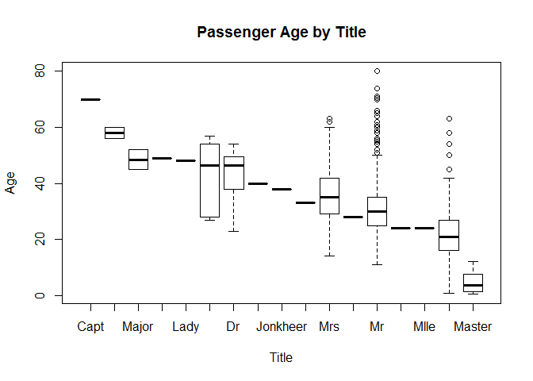 
...produces [this boxplot](https://drive.google.com/file/d/0B-yx9UUIpB6ubEZ5NU5WSFo1U0E/edit?usp=sharing) (too wide for display here) showing passenger age by title, including shading which illustrates the manner in which I consolidated the titles.  I created and applied a custom function for revaluing the titles, then reclassified **Title** to a factor type, as follows:

```r
## function for assigning a new title value to old title(s) 
changeTitles <- function(data, old.titles, new.title) {
  for (honorific in old.titles) {
    data$Title[ which( data$Title == honorific)] <- new.title
  }
  return (data$Title)
}
## Title consolidation
#df.train.tmp = df.train
#df.train=df.train.tmp
write.table (df.train,"dftraintmp.csv")

# Replaced the Noble with Sir, because is is an existing factor

df.train$Title <- changeTitles(
    df.train, 
    c("Capt", "Col", "Don", "Dr", 
    "Jonkheer", "Lady", "Major", 
    "Rev", "Sir"),
    "Sir")
df.train$Title <- changeTitles(df.train, c("the Countess", "Ms"), 
                               "Mrs")
df.train$Title <- changeTitles(df.train, c("Mlle", "Mme"), "Miss")
df.train$Title <- as.factor(df.train$Title)
```
I assigned the Countess of Rothes, a woman in first class and the sole passenger with a "Countess" title, to the "Mrs" group.  In retrospect, I could have placed her under the "Noble" umbrella.  Given that 91 of the 94 female first-class passengers in the training set survived, I was willing to live with that choice.

All of the work done designing the new **Title** column can be considered a part of **feature engineering**.  The other features I chose to add are generated using custom function ``` featureEngrg```, which can be applied to both the training data in **df.train** and the Kaggle-provided test data in **df.infer**.

```r
library(stringr)
```

```
## Warning: package 'stringr' was built under R version 3.2.3
```

```r
library(plyr)
require(plyr)     # for the revalue function 
require(stringr)  # for the str_sub function

## test a character as an EVEN single digit
isEven <- function(x) x %in% c("0","2","4","6","8") 
## test a character as an ODD single digit
isOdd <- function(x) x %in% c("1","3","5","7","9") 

## function to add features to training or test data frames
featureEngrg <- function(data) {
  ## Using Fate ILO Survived because term is shorter and just sounds good
  data$Fate <- data$Survived
  ## Revaluing Fate factor to ease assessment of confusion matrices later
  data$Fate <- revalue(data$Fate, c("1" = "Survived", "0" = "Perished"))
  ## Boat.dibs attempts to capture the "women and children first"
  ## policy in one feature.  Assuming all females plus males under 15
  ## got "dibs' on access to a lifeboat
  data$Boat.dibs <- "No"
  data$Boat.dibs[which(data$Sex == "female" | data$Age < 15)] <- "Yes"
  data$Boat.dibs <- as.factor(data$Boat.dibs)
  ## Family consolidates siblings and spouses (SibSp) plus
  ## parents and children (Parch) into one feature
  data$Family <- data$SibSp + data$Parch
  ## Fare.pp attempts to adjust group purchases by size of family
  data$Fare.pp <- data$Fare/(data$Family + 1)
  ## Giving the traveling class feature a new look
  data$Class <- data$Pclass
  data$Class <- revalue(data$Class, 
                        c("1"="First", "2"="Second", "3"="Third"))
  ## First character in Cabin number represents the Deck 
  data$Deck <- substring(data$Cabin, 1, 1)
  data$Deck[ which( is.na(data$Deck ))] <- "UNK"
  data$Deck <- as.factor(data$Deck)
  ## Odd-numbered cabins were reportedly on the port side of the ship
  ## Even-numbered cabins assigned Side="starboard"
  data$cabin.last.digit <- str_sub(data$Cabin, -1)
  data$Side <- "UNK"
  data$Side[which(isEven(data$cabin.last.digit))] <- "port"
  data$Side[which(isOdd(data$cabin.last.digit))] <- "starboard"
  data$Side <- as.factor(data$Side)
  data$cabin.last.digit <- NULL
  return (data)
}

## add remaining features to training data frame
df.train <- featureEngrg(df.train)
```
Some color on the features I've added:
* **Boat.dibs** - assumes all females plus males under 15 get "dibs' on access to a lifeboat.  Filtering by **Title="Master"** was considered, but the highest age in the training data for males addressed as "Master" was just 12, and I wanted to account for male teens with **Title="Mr"** who could pass for a child.
* **Deck** - levels are as shown in the Titanic cross-section displayed previously.  Cabin data provided for just 23 percent of training data records, so it's tough to give this one much emphasis.
* **Side** - subject to the same concern (dearth of data) expressed for Deck

I finish the data munging process by paring down the data frame to the columns I will use in model building.

```r
train.keeps <- c("Fate", "Sex", "Boat.dibs", "Age", "Title", 
                 "Class", "Deck", "Side", "Fare", "Fare.pp", 
                 "Embarked", "Family")
df.train.munged <- df.train[train.keeps]
str(df.train.munged)
```

```
## 'data.frame':	891 obs. of  12 variables:
##  $ Fate     : Factor w/ 2 levels "Perished","Survived": 1 2 2 2 1 1 1 1 2 2 ...
##  $ Sex      : Factor w/ 2 levels "female","male": 2 1 1 1 2 2 2 2 1 1 ...
##  $ Boat.dibs: Factor w/ 2 levels "No","Yes": 1 2 2 2 1 1 1 2 2 2 ...
##  $ Age      : num  22 38 26 35 35 30 54 2 27 14 ...
##  $ Title    : Factor w/ 17 levels "Capt","Col","Major",..: 13 11 16 11 13 13 13 17 11 11 ...
##  $ Class    : Factor w/ 3 levels "First","Second",..: 3 1 3 1 3 3 1 3 3 2 ...
##  $ Deck     : Factor w/ 9 levels "A","B","C","D",..: 9 3 9 3 9 9 5 9 9 9 ...
##  $ Side     : Factor w/ 3 levels "port","starboard",..: 3 2 3 2 3 3 1 3 3 3 ...
##  $ Fare     : num  7.25 71.28 7.92 53.1 8.05 ...
##  $ Fare.pp  : num  3.62 35.64 7.92 26.55 8.05 ...
##  $ Embarked : Factor w/ 3 levels "C","Q","S": 3 1 3 3 3 2 3 3 3 1 ...
##  $ Family   : int  1 1 0 1 0 0 0 4 2 1 ...
```

## Fitting a Model

Later, I will be conducting the predictive modeling effort using the ``` caret``` package.  Created by Max Kuhn of Pfizer Global R&D, ```caret```provides a unified interface for modeling & prediction, and streamlines the model tuning process using resampling.  [The package](http://cran.r-project.org/web/packages/caret/index.html) includes a ``` createDataPartition``` function for splitting data into a training set and a test set (sometimes referred to as a *validation* set) via [stratified random sampling](http://www.investopedia.com/terms/stratified_random_sampling.asp).  In [this presentation](https://drive.google.com/file/d/0B-yx9UUIpB6uaGVQVmhveGNjNDQ/edit?usp=sharing), Kuhn delivered the best explanation I've seen of the decision on how to "spend" the available training data.  His conclusion: 
> Statistically, the best course of action would be to use all the data for model building and use statistical methods to get good estimates of error.  From a non-statistical perspective, many consumers of these models emphasize the need for an untouched set of samples to evaluate performance.

I selected an 80/20 split for training data and testing data.  The code:

```r
library(caret)
```

```
## Warning: package 'caret' was built under R version 3.2.3
```

```
## 
## Attaching package: 'caret'
## 
## The following object is masked from 'package:survival':
## 
##     cluster
```

```r
## split training data into train batch and test batch
set.seed(23)
training.rows <- createDataPartition(
    df.train.munged$Fate, p = 0.8, list = FALSE)
train.batch <- df.train.munged[training.rows, ]
test.batch <- df.train.munged[-training.rows, ]

# temporary fix for missing value
#test.batch[36,5]="Mr"
```
Before I go pouring features into the popular Random Forest method, I'm going to give one of the simplest classification methods a crack at the Titanic prediction challenge.  Logistic regression, which surfaced about 70 years ago, has been used extensively in multiple fields.  I'll start simple by passing essentially the features provided in the raw training data (remember that we combined ``` SibSp``` and ``` Parch``` to form ``` Family```) through the R function for fitting general linearized models.  When entering the model formula, I typically have a habit of listing the features in an order roughly corresponding to what I initially believe their importance will be.  In this case, I've ordered them roughly by the two main themes I discussed earlier (women & children first policy and location on the ship).  By setting the argument ``` family``` to ``` binomial``` with a ``` logit``` link, I'm asking ``` glm( )``` to produce a logistic regression.


```r
Titanic.logit.1 <- glm(Fate ~ Sex + Class + Age + Family + 
    Embarked+ Fare, data = train.batch, family=binomial("logit"))
```
To assess this first model and the various binary logistic regressions that will appear in its wake, we will use the [chi-square](http://en.wikipedia.org/wiki/Chi-squared_test) statistic, which is basically a measure of the *goodness of fit* of observed values to expected values.  The bigger the difference (or *deviance*) of the observed values from the expected values, the poorer the fit of the model.  The *null deviance* shows how well passenger survival is predicted by a "null" model using only a constant ([grand mean](http://en.wikipedia.org/wiki/Grand_mean)).   As we adjust the model's formula by adding and/or removing variables, we'll look for those changes which prompt a drop in the *residual deviance*, indicating an improvement in fit.

```r
Titanic.logit.1
```

```
## 
## Call:  glm(formula = Fate ~ Sex + Class + Age + Family + Embarked + 
##     Fare, family = binomial("logit"), data = train.batch)
## 
## Coefficients:
## (Intercept)      Sexmale  ClassSecond   ClassThird          Age  
##     4.47735     -2.63750     -1.14829     -2.32037     -0.04498  
##      Family    EmbarkedQ    EmbarkedS         Fare  
##    -0.22278     -0.10612     -0.54006      0.00177  
## 
## Degrees of Freedom: 713 Total (i.e. Null);  705 Residual
## Null Deviance:	    951 
## Residual Deviance: 631 	AIC: 649
```

```r
#Call:  glm(formula = Fate ~ Sex + Class + Age + Family + Embarked + 
#    Fare, family = binomial("logit"), data = train.batch)

#Coefficients:
#(Intercept)      Sexmale  ClassSecond   ClassThird          Age       Family  
#  4.1991007   -2.7367328   -0.9333119   -2.0678612   -0.0441754   -0.2871471  
#  EmbarkedQ    EmbarkedS         Fare  
#  0.0003177   -0.4913073    0.0052758  

#Degrees of Freedom: 713 Total (i.e. Null);  705 Residual
#Null Deviance:        950.9 
#Residual Deviance:    618.7     AIC: 636.7
```
The deviance was reduced by 332.2 points on 713-705=8 degrees of freedom (DF), a significant reduction... 

```r
1 - pchisq(332.2, df=8)
```

```
## [1] 0
```

```r
#[1] 0
```
In other words, the model put forth is significantly different from the null model. Overall, the model appears to have performed well -- but I'm willing to bet that we could improve on that residual deviance with a different combination of features. Calling ``` anova()```, an extractor function, generates the results of the analysis. 

```r
anova(Titanic.logit.1, test="Chisq")
```

```
## Analysis of Deviance Table
## 
## Model: binomial, link: logit
## 
## Response: Fate
## 
## Terms added sequentially (first to last)
## 
## 
##          Df Deviance Resid. Df Resid. Dev Pr(>Chi)    
## NULL                       713        951             
## Sex       1    202.7       712        748  < 2e-16 ***
## Class     2     76.1       710        672  < 2e-16 ***
## Age       1     23.7       709        648  1.1e-06 ***
## Family    1     11.4       708        637  0.00075 ***
## Embarked  2      5.5       706        632  0.06452 .  
## Fare      1      0.5       705        631  0.48187    
## ---
## Signif. codes:  0 '***' 0.001 '**' 0.01 '*' 0.05 '.' 0.1 ' ' 1
```

```r
#Analysis of Deviance Table

#Model: binomial, link: logit

#Response: Fate

#Terms added sequentially (first to last)

#     Df Deviance Resid. Df Resid. Dev  Pr(>Chi)    
#NULL                       713     950.86              
#Sex       1  218.443       712     732.42 < 2.2e-16 ***
#Class     2   72.191       710     660.23 < 2.2e-16 ***
#Age       1   19.971       709     640.26 7.862e-06 ***
#Family    1   13.135       708     627.12 0.0002899 ***
#Embarked  2    5.608       706     621.52 0.0605668 .  
#Fare      1    2.855       705     618.66 0.0911186 .  
#---
#Signif. codes:  0 ‘***’ 0.001 ‘**’ 0.01 ‘*’ 0.05 ‘.’ 0.1 ‘ ’ 1
```
Notice how the **Sex** and **Class** features accounted for the lion's share of the reduction in the deviance, providing some support to our hypotheses about life boat access and location on ship. Since **Fare** isn't doing much for us, let's see if the **Fare.pp** we created fares any better (pun intended).

```r
Titanic.logit.2 <- glm(Fate ~ Sex + Class + Age + Family + Embarked + Fare.pp,                       data = train.batch, family=binomial("logit"))
anova(Titanic.logit.2, test="Chisq")
```

```
## Analysis of Deviance Table
## 
## Model: binomial, link: logit
## 
## Response: Fate
## 
## Terms added sequentially (first to last)
## 
## 
##          Df Deviance Resid. Df Resid. Dev Pr(>Chi)    
## NULL                       713        951             
## Sex       1    202.7       712        748  < 2e-16 ***
## Class     2     76.1       710        672  < 2e-16 ***
## Age       1     23.7       709        648  1.1e-06 ***
## Family    1     11.4       708        637  0.00075 ***
## Embarked  2      5.5       706        632  0.06452 .  
## Fare.pp   1      0.3       705        631  0.60089    
## ---
## Signif. codes:  0 '***' 0.001 '**' 0.01 '*' 0.05 '.' 0.1 ' ' 1
```

```r
#Analysis of Deviance Table

#Model: binomial, link: logit

#Response: Fate

#Terms added sequentially (first to last)

#         Df Deviance Resid. Df Resid. Dev  Pr(>Chi)    
#NULL                       713     950.86              
#Sex       1  218.443       712     732.42 < 2.2e-16 ***
#Class     2   72.191       710     660.23 < 2.2e-16 ***
#Age       1   19.971       709     640.26 7.862e-06 ***
#Family    1   13.135       708     627.12 0.0002899 ***
#Embarked  2    5.608       706     621.52 0.0605668 .  
#Fare.pp   1    1.312       705     620.21 0.2521103    
#---
#Signif. codes:  0 ‘***’ 0.001 ‘**’ 0.01 ‘*’ 0.05 ‘.’ 0.1 ‘ ’ 1
```
Hmm, that was no help.  Dropping fares altogether and passing a slightly slimmer formula through the ``` glm()``` function will give us a new baseline for model improvement.

```r
glm(Fate ~ Sex + Class + Age + Family + Embarked, 
    data = train.batch, family=binomial("logit"))
```

```
## 
## Call:  glm(formula = Fate ~ Sex + Class + Age + Family + Embarked, family = binomial("logit"), 
##     data = train.batch)
## 
## Coefficients:
## (Intercept)      Sexmale  ClassSecond   ClassThird          Age  
##      4.6425      -2.6415      -1.2451      -2.4388      -0.0454  
##      Family    EmbarkedQ    EmbarkedS  
##     -0.2102      -0.1280      -0.5704  
## 
## Degrees of Freedom: 713 Total (i.e. Null);  706 Residual
## Null Deviance:	    951 
## Residual Deviance: 632 	AIC: 648
```

```r
#Call:  glm(formula = Fate ~ Sex + Class + Age + Family + Embarked, family = #binomial("logit"), data = train.batch)

#Coefficients:
#(Intercept)      Sexmale  ClassSecond   ClassThird          Age       Family  
#    4.60950     -2.74715     -1.19354     -2.38903     -0.04466     -0.24416  
#  EmbarkedQ    EmbarkedS  
#   -0.03949     -0.55186  

#Degrees of Freedom: 713 Total (i.e. Null);  706 Residual
#Null Deviance:        950.9 
#Residual Deviance:    621.5 	AIC: 637.5
```
Time to shift the model fitting to a higher gear.  Henceforth, I'm going to use the ``` train``` function in Kuhn's ``` caret``` package to fit binary logistic regression models, as well as models built using other methods.

Modeling taken to an extreme on a training data set can leave you with a model which *very* accurately maps the training data, but does not generalize well to new samples.  This phenomenon, commonly referred to as *overfitting*, can be addressed by resampling the training samples in a way which approximates the fitted model's performance on future data. I'm going to use a form of resampling known as 10-fold cross-validation (CV), repeated 3 times.

Later, I plan to compare the fitted logit model to other model types using the receiver operating characteristic (ROC) curve.  The ``` twoClassSummary``` function in ``` caret``` can calculate the figures I'll need for that if I give it class probabilities predicted by the logistic regression model.

All of these things I want -- 3x 10-fold CV, estimation of class probabilities, metrics from ``` twoClassSummary``` -- can be passed through the ``` trainControl``` function.

```r
## Define control function to handle optional arguments for train function
## Models to be assessed based on largest absolute area under ROC curve
cv.ctrl <- trainControl(method = "repeatedcv", repeats = 3,
                        summaryFunction = twoClassSummary,
                        classProbs = TRUE)
```
Below is the ``` train``` function call using the same formula (sans Fare) that we recently passed through ``` glm``` function. I use the ``` metric``` argument to tell ``` train``` to optimize the model by maximizing the area under the ROC curve (AUC).  ``` summary()```, another extractor function, is called to generate regression coefficients with standard errors and a z-test, plus the residual deviance metric we were watching earlier.

```r
#install.packages("pROC")

library (pROC)
```

```
## Warning: package 'pROC' was built under R version 3.2.3
```

```
## Type 'citation("pROC")' for a citation.
## 
## Attaching package: 'pROC'
## 
## The following objects are masked from 'package:stats':
## 
##     cov, smooth, var
```

```r
set.seed(35)
glm.tune.1 <- train(Fate ~ Sex + Class + Age + Family + Embarked,
                    data = train.batch,
                    method = "glm",
                    metric = "ROC",
                    trControl = cv.ctrl)
glm.tune.1
```

```
## Generalized Linear Model 
## 
## 714 samples
##  11 predictor
##   2 classes: 'Perished', 'Survived' 
## 
## No pre-processing
## Resampling: Cross-Validated (10 fold, repeated 3 times) 
## Summary of sample sizes: 643, 643, 643, 642, 643, 643, ... 
## Resampling results
## 
##   ROC   Sens  Spec  ROC SD  Sens SD  Spec SD
##   0.85  0.85  0.7   0.05    0.055    0.085  
## 
## 
```

```r
#714 samples
# 11 predictors
#  2 classes: 'Perished', 'Survived' 

#No pre-processing
#Resampling: Cross-Validation (10 fold, repeated 3 times) 

#Summary of sample sizes: 642, 643, 643, 642, 643, 642, ... 

#Resampling results

#  ROC    Sens   Spec   ROC SD  Sens SD  Spec SD
#  0.856  0.855  0.698  0.0433  0.071    0.0852 

summary(glm.tune.1)
```

```
## 
## Call:
## NULL
## 
## Deviance Residuals: 
##    Min      1Q  Median      3Q     Max  
## -2.219  -0.615  -0.423   0.637   2.472  
## 
## Coefficients:
##             Estimate Std. Error z value Pr(>|z|)    
## (Intercept)  4.64254    0.48679    9.54  < 2e-16 ***
## Sexmale     -2.64146    0.22237  -11.88  < 2e-16 ***
## ClassSecond -1.24511    0.30481   -4.08  4.4e-05 ***
## ClassThird  -2.43880    0.28496   -8.56  < 2e-16 ***
## Age         -0.04542    0.00882   -5.15  2.6e-07 ***
## Family      -0.21021    0.07263   -2.89   0.0038 ** 
## EmbarkedQ   -0.12801    0.41992   -0.30   0.7605    
## EmbarkedS   -0.57038    0.26374   -2.16   0.0306 *  
## ---
## Signif. codes:  0 '***' 0.001 '**' 0.01 '*' 0.05 '.' 0.1 ' ' 1
## 
## (Dispersion parameter for binomial family taken to be 1)
## 
##     Null deviance: 950.86  on 713  degrees of freedom
## Residual deviance: 631.51  on 706  degrees of freedom
## AIC: 647.5
## 
## Number of Fisher Scoring iterations: 5
```

```r
#Call:
# NULL
# 
# Deviance Residuals: 
#     Min       1Q   Median       3Q      Max  
# -2.2206  -0.5945  -0.4131   0.6208   2.5031  
# 
# Coefficients:
#             Estimate Std. Error z value Pr(>|z|)    
# (Intercept)  4.60950    0.50032   9.213  < 2e-16 ***
# Sexmale     -2.74715    0.22441 -12.242  < 2e-16 ***
# ClassSecond -1.19354    0.30646  -3.895 9.84e-05 ***
# ClassThird  -2.38903    0.28411  -8.409  < 2e-16 ***
# Age         -0.04466    0.00908  -4.918 8.73e-07 ***
# Family      -0.24416    0.07787  -3.136  0.00171 ** 
# EmbarkedQ   -0.03949    0.42227  -0.094  0.92549    
# EmbarkedS   -0.55186    0.26154  -2.110  0.03485 *  
# ---
# Signif. codes:  0 ‘***’ 0.001 ‘**’ 0.01 ‘*’ 0.05 ‘.’ 0.1 ‘ ’ 1
# 
# (Dispersion parameter for binomial family taken to be 1)
# 
#     Null deviance: 950.86  on 713  degrees of freedom
# Residual deviance: 621.52  on 706  degrees of freedom
# AIC: 637.52
# 
# Number of Fisher Scoring iterations: 5
```
This is as good a time as any to introduce the concept of *class compression*.  Think of it as collapsing particular levels on a categorical variable.  One of the earlier bar graphs showed about 70 percent of the Titanic's passengers boarded the ship at Southampton.  I'm going to use **Embarked** and the ``` I()``` function, which inhibits interpretation & conversion of R objects, to create a new 2-level factor *within* the model formula.  This factor is valued TRUE if a passenger's port of origin was Southampton ("S"), or FALSE otherwise.

```r
 set.seed(35)
 glm.tune.2 <- train(Fate ~ Sex + Class + Age + Family + I(Embarked=="S"),
                      data = train.batch, method = "glm",
                      metric = "ROC", trControl = cv.ctrl)
 summary(glm.tune.2)
```

```
## 
## Call:
## NULL
## 
## Deviance Residuals: 
##    Min      1Q  Median      3Q     Max  
## -2.205  -0.616  -0.421   0.643   2.475  
## 
## Coefficients:
##                          Estimate Std. Error z value Pr(>|z|)    
## (Intercept)               4.61217    0.47557    9.70  < 2e-16 ***
## Sexmale                  -2.63740    0.22180  -11.89  < 2e-16 ***
## ClassSecond              -1.25529    0.30287   -4.14  3.4e-05 ***
## ClassThird               -2.46079    0.27577   -8.92  < 2e-16 ***
## Age                      -0.04547    0.00881   -5.16  2.5e-07 ***
## Family                   -0.20848    0.07231   -2.88   0.0039 ** 
## `I(Embarked == "S")TRUE` -0.52963    0.22742   -2.33   0.0199 *  
## ---
## Signif. codes:  0 '***' 0.001 '**' 0.01 '*' 0.05 '.' 0.1 ' ' 1
## 
## (Dispersion parameter for binomial family taken to be 1)
## 
##     Null deviance: 950.86  on 713  degrees of freedom
## Residual deviance: 631.60  on 707  degrees of freedom
## AIC: 645.6
## 
## Number of Fisher Scoring iterations: 5
```

```r
# Call:
# NULL
# 
# Deviance Residuals: 
#     Min       1Q   Median       3Q      Max  
# -2.2165  -0.5935  -0.4127   0.6230   2.5039  
# 
# Coefficients:
#                           Estimate Std. Error z value Pr(>|z|)    
# (Intercept)               4.599379   0.488154   9.422  < 2e-16 ***
# Sexmale                  -2.745061   0.223226 -12.297  < 2e-16 ***
# ClassSecond              -1.196456   0.304837  -3.925 8.68e-05 ***
# ClassThird               -2.395542   0.275479  -8.696  < 2e-16 ***
# Age                      -0.044652   0.009076  -4.920 8.66e-07 ***
# Family                   -0.243642   0.077633  -3.138   0.0017 ** 
# `I(Embarked == "S")TRUE` -0.539793   0.227551  -2.372   0.0177 *  
# ---
# Signif. codes:  0 ‘***’ 0.001 ‘**’ 0.01 ‘*’ 0.05 ‘.’ 0.1 ‘ ’ 1
# 
# (Dispersion parameter for binomial family taken to be 1)
# 
#     Null deviance: 950.86  on 713  degrees of freedom
# Residual deviance: 621.53  on 707  degrees of freedom
# AIC: 635.53
# 
# Number of Fisher Scoring iterations: 5
```
As I discussed earlier, the **Title** feature addresses more than one theme.  For that reason, I believe it has real potential to improve this model.  Besides, I put a good chunk of effort into it, so why not give it a go? 

```r
 set.seed(35)
 glm.tune.3 <- train(Fate ~ Sex + Class + Title + Age 
                      + Family + I(Embarked=="S"), 
                      data = train.batch, method = "glm",
                      metric = "ROC", trControl = cv.ctrl)
```

```
## Warning in predict.lm(object, newdata, se.fit, scale = 1, type =
## ifelse(type == : prediction from a rank-deficient fit may be misleading
```

```
## Warning in predict.lm(object, newdata, se.fit, scale = 1, type =
## ifelse(type == : prediction from a rank-deficient fit may be misleading
```

```
## Warning in predict.lm(object, newdata, se.fit, scale = 1, type =
## ifelse(type == : prediction from a rank-deficient fit may be misleading
```

```
## Warning in predict.lm(object, newdata, se.fit, scale = 1, type =
## ifelse(type == : prediction from a rank-deficient fit may be misleading
```

```
## Warning in predict.lm(object, newdata, se.fit, scale = 1, type =
## ifelse(type == : prediction from a rank-deficient fit may be misleading
```

```
## Warning in predict.lm(object, newdata, se.fit, scale = 1, type =
## ifelse(type == : prediction from a rank-deficient fit may be misleading
```

```
## Warning in predict.lm(object, newdata, se.fit, scale = 1, type =
## ifelse(type == : prediction from a rank-deficient fit may be misleading
```

```
## Warning in predict.lm(object, newdata, se.fit, scale = 1, type =
## ifelse(type == : prediction from a rank-deficient fit may be misleading
```

```
## Warning in predict.lm(object, newdata, se.fit, scale = 1, type =
## ifelse(type == : prediction from a rank-deficient fit may be misleading
```

```
## Warning in predict.lm(object, newdata, se.fit, scale = 1, type =
## ifelse(type == : prediction from a rank-deficient fit may be misleading
```

```
## Warning in predict.lm(object, newdata, se.fit, scale = 1, type =
## ifelse(type == : prediction from a rank-deficient fit may be misleading
```

```
## Warning in predict.lm(object, newdata, se.fit, scale = 1, type =
## ifelse(type == : prediction from a rank-deficient fit may be misleading
```

```
## Warning in predict.lm(object, newdata, se.fit, scale = 1, type =
## ifelse(type == : prediction from a rank-deficient fit may be misleading
```

```
## Warning in predict.lm(object, newdata, se.fit, scale = 1, type =
## ifelse(type == : prediction from a rank-deficient fit may be misleading
```

```
## Warning in predict.lm(object, newdata, se.fit, scale = 1, type =
## ifelse(type == : prediction from a rank-deficient fit may be misleading
```

```
## Warning in predict.lm(object, newdata, se.fit, scale = 1, type =
## ifelse(type == : prediction from a rank-deficient fit may be misleading
```

```
## Warning in predict.lm(object, newdata, se.fit, scale = 1, type =
## ifelse(type == : prediction from a rank-deficient fit may be misleading
```

```
## Warning in predict.lm(object, newdata, se.fit, scale = 1, type =
## ifelse(type == : prediction from a rank-deficient fit may be misleading
```

```
## Warning in predict.lm(object, newdata, se.fit, scale = 1, type =
## ifelse(type == : prediction from a rank-deficient fit may be misleading
```

```
## Warning in predict.lm(object, newdata, se.fit, scale = 1, type =
## ifelse(type == : prediction from a rank-deficient fit may be misleading
```

```
## Warning in predict.lm(object, newdata, se.fit, scale = 1, type =
## ifelse(type == : prediction from a rank-deficient fit may be misleading
```

```
## Warning in predict.lm(object, newdata, se.fit, scale = 1, type =
## ifelse(type == : prediction from a rank-deficient fit may be misleading
```

```
## Warning in predict.lm(object, newdata, se.fit, scale = 1, type =
## ifelse(type == : prediction from a rank-deficient fit may be misleading
```

```
## Warning in predict.lm(object, newdata, se.fit, scale = 1, type =
## ifelse(type == : prediction from a rank-deficient fit may be misleading
```

```
## Warning in predict.lm(object, newdata, se.fit, scale = 1, type =
## ifelse(type == : prediction from a rank-deficient fit may be misleading
```

```
## Warning in predict.lm(object, newdata, se.fit, scale = 1, type =
## ifelse(type == : prediction from a rank-deficient fit may be misleading
```

```
## Warning in predict.lm(object, newdata, se.fit, scale = 1, type =
## ifelse(type == : prediction from a rank-deficient fit may be misleading
```

```
## Warning in predict.lm(object, newdata, se.fit, scale = 1, type =
## ifelse(type == : prediction from a rank-deficient fit may be misleading
```

```
## Warning in predict.lm(object, newdata, se.fit, scale = 1, type =
## ifelse(type == : prediction from a rank-deficient fit may be misleading
```

```
## Warning in predict.lm(object, newdata, se.fit, scale = 1, type =
## ifelse(type == : prediction from a rank-deficient fit may be misleading
```

```
## Warning in predict.lm(object, newdata, se.fit, scale = 1, type =
## ifelse(type == : prediction from a rank-deficient fit may be misleading
```

```
## Warning in predict.lm(object, newdata, se.fit, scale = 1, type =
## ifelse(type == : prediction from a rank-deficient fit may be misleading
```

```
## Warning in predict.lm(object, newdata, se.fit, scale = 1, type =
## ifelse(type == : prediction from a rank-deficient fit may be misleading
```

```
## Warning in predict.lm(object, newdata, se.fit, scale = 1, type =
## ifelse(type == : prediction from a rank-deficient fit may be misleading
```

```
## Warning in predict.lm(object, newdata, se.fit, scale = 1, type =
## ifelse(type == : prediction from a rank-deficient fit may be misleading
```

```
## Warning in predict.lm(object, newdata, se.fit, scale = 1, type =
## ifelse(type == : prediction from a rank-deficient fit may be misleading
```

```
## Warning in predict.lm(object, newdata, se.fit, scale = 1, type =
## ifelse(type == : prediction from a rank-deficient fit may be misleading
```

```
## Warning in predict.lm(object, newdata, se.fit, scale = 1, type =
## ifelse(type == : prediction from a rank-deficient fit may be misleading
```

```
## Warning in predict.lm(object, newdata, se.fit, scale = 1, type =
## ifelse(type == : prediction from a rank-deficient fit may be misleading
```

```
## Warning in predict.lm(object, newdata, se.fit, scale = 1, type =
## ifelse(type == : prediction from a rank-deficient fit may be misleading
```

```
## Warning in predict.lm(object, newdata, se.fit, scale = 1, type =
## ifelse(type == : prediction from a rank-deficient fit may be misleading
```

```
## Warning in predict.lm(object, newdata, se.fit, scale = 1, type =
## ifelse(type == : prediction from a rank-deficient fit may be misleading
```

```
## Warning in predict.lm(object, newdata, se.fit, scale = 1, type =
## ifelse(type == : prediction from a rank-deficient fit may be misleading
```

```
## Warning in predict.lm(object, newdata, se.fit, scale = 1, type =
## ifelse(type == : prediction from a rank-deficient fit may be misleading
```

```
## Warning in predict.lm(object, newdata, se.fit, scale = 1, type =
## ifelse(type == : prediction from a rank-deficient fit may be misleading
```

```
## Warning in predict.lm(object, newdata, se.fit, scale = 1, type =
## ifelse(type == : prediction from a rank-deficient fit may be misleading
```

```
## Warning in predict.lm(object, newdata, se.fit, scale = 1, type =
## ifelse(type == : prediction from a rank-deficient fit may be misleading
```

```
## Warning in predict.lm(object, newdata, se.fit, scale = 1, type =
## ifelse(type == : prediction from a rank-deficient fit may be misleading
```

```
## Warning in predict.lm(object, newdata, se.fit, scale = 1, type =
## ifelse(type == : prediction from a rank-deficient fit may be misleading
```

```
## Warning in predict.lm(object, newdata, se.fit, scale = 1, type =
## ifelse(type == : prediction from a rank-deficient fit may be misleading
```

```
## Warning in predict.lm(object, newdata, se.fit, scale = 1, type =
## ifelse(type == : prediction from a rank-deficient fit may be misleading
```

```
## Warning in predict.lm(object, newdata, se.fit, scale = 1, type =
## ifelse(type == : prediction from a rank-deficient fit may be misleading
```

```
## Warning in predict.lm(object, newdata, se.fit, scale = 1, type =
## ifelse(type == : prediction from a rank-deficient fit may be misleading
```

```
## Warning in predict.lm(object, newdata, se.fit, scale = 1, type =
## ifelse(type == : prediction from a rank-deficient fit may be misleading
```

```
## Warning in predict.lm(object, newdata, se.fit, scale = 1, type =
## ifelse(type == : prediction from a rank-deficient fit may be misleading
```

```
## Warning in predict.lm(object, newdata, se.fit, scale = 1, type =
## ifelse(type == : prediction from a rank-deficient fit may be misleading
```

```
## Warning in predict.lm(object, newdata, se.fit, scale = 1, type =
## ifelse(type == : prediction from a rank-deficient fit may be misleading
```

```
## Warning in predict.lm(object, newdata, se.fit, scale = 1, type =
## ifelse(type == : prediction from a rank-deficient fit may be misleading
```

```
## Warning in predict.lm(object, newdata, se.fit, scale = 1, type =
## ifelse(type == : prediction from a rank-deficient fit may be misleading
```

```
## Warning in predict.lm(object, newdata, se.fit, scale = 1, type =
## ifelse(type == : prediction from a rank-deficient fit may be misleading
```

```r
 summary(glm.tune.3)
```

```
## 
## Call:
## NULL
## 
## Deviance Residuals: 
##    Min      1Q  Median      3Q     Max  
## -2.348  -0.577  -0.388   0.573   2.495  
## 
## Coefficients: (12 not defined because of singularities)
##                          Estimate Std. Error z value Pr(>|z|)    
## (Intercept)               19.9897   623.5558    0.03  0.97443    
## Sexmale                  -15.2853   623.5554   -0.02  0.98044    
## ClassSecond               -1.4387     0.3313   -4.34  1.4e-05 ***
## ClassThird                -2.5456     0.2964   -8.59  < 2e-16 ***
## TitleCol                       NA         NA      NA       NA    
## TitleMajor                     NA         NA      NA       NA    
## TitleSir                  -3.1380     0.8273   -3.79  0.00015 ***
## TitleLady                      NA         NA      NA       NA    
## TitleRev                       NA         NA      NA       NA    
## TitleDr                        NA         NA      NA       NA    
## TitleDon                       NA         NA      NA       NA    
## TitleJonkheer                  NA         NA      NA       NA    
## `Titlethe Countess`            NA         NA      NA       NA    
## TitleMrs                 -14.5311   623.5557   -0.02  0.98141    
## TitleMs                        NA         NA      NA       NA    
## TitleMr                   -3.0466     0.5716   -5.33  9.8e-08 ***
## TitleMme                       NA         NA      NA       NA    
## TitleMlle                      NA         NA      NA       NA    
## TitleMiss                -15.5786   623.5557   -0.02  0.98007    
## TitleMaster                    NA         NA      NA       NA    
## Age                       -0.0370     0.0106   -3.47  0.00052 ***
## Family                    -0.4303     0.0892   -4.83  1.4e-06 ***
## `I(Embarked == "S")TRUE`  -0.5542     0.2351   -2.36  0.01840 *  
## ---
## Signif. codes:  0 '***' 0.001 '**' 0.01 '*' 0.05 '.' 0.1 ' ' 1
## 
## (Dispersion parameter for binomial family taken to be 1)
## 
##     Null deviance: 950.86  on 713  degrees of freedom
## Residual deviance: 588.32  on 703  degrees of freedom
## AIC: 610.3
## 
## Number of Fisher Scoring iterations: 13
```

```r
# Coefficients:
#                           Estimate Std. Error z value Pr(>|z|)    
# (Intercept)               19.98972  623.55577   0.032 0.974426    
# Sexmale                  -15.28525  623.55543  -0.025 0.980443    
# TitleMiss                -15.57857  623.55565  -0.025 0.980068    
# TitleMr                   -3.04656    0.57156  -5.330 9.81e-08 ***
# TitleMrs                 -14.53106  623.55571  -0.023 0.981408    
# TitleNoble                -3.13799    0.82733  -3.793 0.000149 ***
# Age                       -0.03695    0.01065  -3.471 0.000518 ***
# Family                    -0.43025    0.08915  -4.826 1.39e-06 ***
# ClassSecond               -1.43867    0.33135  -4.342 1.41e-05 ***
# ClassThird                -2.54556    0.29641  -8.588  < 2e-16 ***
# `I(Embarked == "S")TRUE`  -0.55423    0.23509  -2.358 0.018395 *  
# ---
# Signif. codes:  0 ‘***’ 0.001 ‘**’ 0.01 ‘*’ 0.05 ‘.’ 0.1 ‘ ’ 1
# 
# (Dispersion parameter for binomial family taken to be 1)
# 
#     Null deviance: 950.86  on 713  degrees of freedom
# Residual deviance: 588.32  on 703  degrees of freedom
# AIC: 610.32
# 
# Number of Fisher Scoring iterations: 13
```
Nice!  That gave us our first material decline in the residual deviance.  Since the **Title** feature seems to give us everything that **Age** did (and more), I'm going to drop **Age** from the formula. I will also collapse the titles “Miss” and “Mrs” and leave a duo of Title-related factors which should represent the “women and children first” theme well.

```r
set.seed(35)
# subst Sir for Noble 
glm.tune.4 <- train(Fate ~ Class + I(Title=="Mr") + I(Title=="Sir") 
                      + Age + Family + I(Embarked=="S"), 
                      data = train.batch, method = "glm",
                      metric = "ROC", trControl = cv.ctrl)
summary(glm.tune.4)
```

```
## 
## Call:
## NULL
## 
## Deviance Residuals: 
##    Min      1Q  Median      3Q     Max  
## -2.499  -0.596  -0.385   0.596   2.435  
## 
## Coefficients:
##                          Estimate Std. Error z value Pr(>|z|)    
## (Intercept)               4.32392    0.46933    9.21  < 2e-16 ***
## ClassSecond              -1.31283    0.31657   -4.15  3.4e-05 ***
## ClassThird               -2.46318    0.28933   -8.51  < 2e-16 ***
## `I(Title == "Mr")TRUE`   -3.16131    0.25454  -12.42  < 2e-16 ***
## `I(Title == "Sir")TRUE`  -3.03015    0.56164   -5.40  6.8e-08 ***
## Age                      -0.02491    0.00891   -2.80   0.0052 ** 
## Family                   -0.38013    0.07912   -4.80  1.6e-06 ***
## `I(Embarked == "S")TRUE` -0.51538    0.23302   -2.21   0.0270 *  
## ---
## Signif. codes:  0 '***' 0.001 '**' 0.01 '*' 0.05 '.' 0.1 ' ' 1
## 
## (Dispersion parameter for binomial family taken to be 1)
## 
##     Null deviance: 950.86  on 713  degrees of freedom
## Residual deviance: 599.63  on 706  degrees of freedom
## AIC: 615.6
## 
## Number of Fisher Scoring iterations: 5
```

```r
# Call:
# NULL
# 
# Deviance Residuals: 
#     Min       1Q   Median       3Q      Max  
# -2.4813  -0.5646  -0.3840   0.6026   2.4523  
# 
# Coefficients:
#                            Estimate Std. Error z value Pr(>|z|)    
# (Intercept)                4.348090   0.479097   9.076  < 2e-16 ***
# ClassSecond               -1.320352   0.318842  -4.141 3.46e-05 ***
# ClassThird                -2.372211   0.284693  -8.333  < 2e-16 ***
# `I(Title == "Mr")TRUE`    -3.238061   0.253776 -12.760  < 2e-16 ***
# `I(Title == "Noble")TRUE` -2.616810   0.619869  -4.222 2.43e-05 ***
# Age                       -0.026335   0.009127  -2.885  0.00391 ** 
# Family                    -0.434170   0.084179  -5.158 2.50e-07 ***
# `I(Embarked == "S")TRUE`  -0.508882   0.232502  -2.189  0.02862 *  
# ---
# Signif. codes:  0 ‘***’ 0.001 ‘**’ 0.01 ‘*’ 0.05 ‘.’ 0.1 ‘ ’ 1
# 
# (Dispersion parameter for binomial family taken to be 1)
# 
#     Null deviance: 950.86  on 713  degrees of freedom
# Residual deviance: 593.28  on 706  degrees of freedom
# AIC: 609.28
# 
# Number of Fisher Scoring iterations: 5
```
Remember that there were a lot of male passengers in third class.  Given the “women and children first” policy already mentioned plus reports that the Titanic's internal layout was confusing (I recall reading that one crew member claimed it took him two weeks to become comfortable with finding his way around the ship), to say that “grown men in the lower decks had it tough” is such a gross understatement that I hesitated to put it in type.  A feature reflecting those third-class men might make a further dent in that residual deviance.  Indeed, it does...

```r
 set.seed(35)
 glm.tune.5 <- train(Fate ~ Class + I(Title=="Mr") + I(Title=="Sir") 
                      + Age + Family + I(Embarked=="S") 
                      + I(Title=="Mr"&Class=="Third"), 
                      data = train.batch, 
                      method = "glm", metric = "ROC", 
                      trControl = cv.ctrl)
 
summary(glm.tune.5)
```

```
## 
## Call:
## NULL
## 
## Deviance Residuals: 
##    Min      1Q  Median      3Q     Max  
## -3.055  -0.571  -0.421   0.358   2.334  
## 
## Coefficients:
##                                           Estimate Std. Error z value
## (Intercept)                                6.12777    0.71231    8.60
## ClassSecond                               -1.95084    0.43127   -4.52
## ClassThird                                -4.54488    0.60939   -7.46
## `I(Title == "Mr")TRUE`                    -4.98118    0.54835   -9.08
## `I(Title == "Sir")TRUE`                   -4.48154    0.72792   -6.16
## Age                                       -0.02944    0.00975   -3.02
## Family                                    -0.35226    0.08273   -4.26
## `I(Embarked == "S")TRUE`                  -0.55795    0.23065   -2.42
## `I(Title == "Mr" & Class == "Third")TRUE`  2.72557    0.60693    4.49
##                                           Pr(>|z|)    
## (Intercept)                                < 2e-16 ***
## ClassSecond                                6.1e-06 ***
## ClassThird                                 8.8e-14 ***
## `I(Title == "Mr")TRUE`                     < 2e-16 ***
## `I(Title == "Sir")TRUE`                    7.4e-10 ***
## Age                                         0.0025 ** 
## Family                                     2.1e-05 ***
## `I(Embarked == "S")TRUE`                    0.0156 *  
## `I(Title == "Mr" & Class == "Third")TRUE`  7.1e-06 ***
## ---
## Signif. codes:  0 '***' 0.001 '**' 0.01 '*' 0.05 '.' 0.1 ' ' 1
## 
## (Dispersion parameter for binomial family taken to be 1)
## 
##     Null deviance: 950.86  on 713  degrees of freedom
## Residual deviance: 573.80  on 705  degrees of freedom
## AIC: 591.8
## 
## Number of Fisher Scoring iterations: 6
```

```r
# 
# Call:
# NULL
# 
# Deviance Residuals: 
#     Min       1Q   Median       3Q      Max  
# -3.0703  -0.5859  -0.3947   0.3725   2.4811  
# 
# Coefficients:
#                                  Estimate Std. Error z value Pr(>|z|)    
# (Intercept)                       6.33818    0.72561   8.735  < 2e-16 ***
# ClassSecond                      -2.19222    0.48004  -4.567 4.95e-06 ***
# ClassThird                       -4.65442    0.60918  -7.641 2.16e-14 ***
# `I(Title == "Mr")TRUE`           -5.20467    0.54771  -9.503  < 2e-16 ***
# `I(Title == "Noble")TRUE`        -4.07411    0.77141  -5.281 1.28e-07 ***
# Age                              -0.03268    0.01023  -3.194  0.00140 ** 
# Family                           -0.40503    0.08971  -4.515 6.34e-06 ***
# `I(Embarked == "S")TRUE`         -0.59956    0.23065  -2.599  0.00934 ** 
# `I(Title == "Mr"                  3.00867    0.60761   4.952 7.36e-07 ***
#    & Class == "Third")TRUE`
# ---
# Signif. codes:  0 ‘***’ 0.001 ‘**’ 0.01 ‘*’ 0.05 ‘.’ 0.1 ‘ ’ 1
# 
# (Dispersion parameter for binomial family taken to be 1)
# 
#     Null deviance: 950.86  on 713  degrees of freedom
# Residual deviance: 561.11  on 705  degrees of freedom
# AIC: 579.11
# 
# Number of Fisher Scoring iterations: 6
```
 
Unfortunately, the other features did not contribute to further deviance compression.  Taking a different approach to representing the “women and children first” policy didn't bear fruit (removing the title references in the formula and adding Boat.dibs produced a residual deviance of 565 -- no better than what we already have, using a new feature which some may find confusing).  Given that Deck and Side combined (a) shaved just a few points off of the deviance, and (b) were derived from such a small subset of the training data, I decided to withdraw them from consideration.

#### Other Models
Logistic regression is certainly not the only binary classification model available.  There are plenty more –- perhaps too many for some data scientists to digest.  For purpose of illustration, I'll simply take the logistic regression model formula from **glm.tune.1** and pass it through  ``` train()``` for each of three other model types, with one new twist:  tuning variables specific to each model.   

First up is [boosting](http://en.wikipedia.org/wiki/AdaBoost).  I can instruct ``` train``` to fit a *stochastic boosting* model for the binary response **Fate** using the ``` ada```package and a range of values for each of three tuning parameters.  Concretely, when fitting a model using ``` train``` with ``` method=”ada”```, one has three levers to tweak: ``` iter``` (number of boosting iterations, default=50), ``` maxdepth``` (depth of trees), and ``` nu``` (shrinkage parameter, default=1).  Create a data frame with these three variables as column names and one row per tuning variable combination, and you're good to go.  Here is just one example of a tuning grid for ``` ada```:

```r
## note the dot preceding each variable
ada.grid <- expand.grid(.iter = c(50, 100),
                        .maxdepth = c(4, 8),
                        .nu = c(0.1, 1))
```
Specify ``` method=”ada”``` and ``` tuneGrid=ada.grid``` in ``` train```, and away we go...


```r
set.seed(35)

ada.tune <- train(Fate ~ Sex + Class + Age + Family + Embarked, 
                  data = train.batch,
                  method = "ada",
                  metric = "ROC",
                  tuneGrid = ada.grid,
                  trControl = cv.ctrl)
```
The model output shows that, given the **train.batch** data and 8 combinations of tuning variables tested,  the optimal model had an ROC of 0.871.  The tuning parameter values used to build that model were ``` iter = 100```, ``` maxdepth = 4```, and ``` nu = 0.1```.


```r
ada.tune
```

```
## Boosted Classification Trees 
## 
## 714 samples
##  11 predictor
##   2 classes: 'Perished', 'Survived' 
## 
## No pre-processing
## Resampling: Cross-Validated (10 fold, repeated 3 times) 
## Summary of sample sizes: 643, 643, 643, 642, 643, 643, ... 
## Resampling results across tuning parameters:
## 
##   nu   maxdepth  iter  ROC   Sens  Spec  ROC SD  Sens SD  Spec SD
##   0.1  4          50   0.87  0.92  0.66  0.051   0.041    0.101  
##   0.1  4         100   0.87  0.90  0.69  0.052   0.045    0.102  
##   0.1  8          50   0.86  0.90  0.69  0.051   0.046    0.094  
##   0.1  8         100   0.85  0.89  0.70  0.049   0.051    0.087  
##   1.0  4          50   0.86  0.88  0.70  0.048   0.044    0.084  
##   1.0  4         100   0.85  0.88  0.70  0.049   0.050    0.082  
##   1.0  8          50   0.82  0.87  0.72  0.051   0.053    0.098  
##   1.0  8         100   0.82  0.87  0.72  0.054   0.055    0.093  
## 
## ROC was used to select the optimal model using  the largest value.
## The final values used for the model were iter = 50, maxdepth = 4 and nu
##  = 0.1.
```

```r
# 714 samples
#  11 predictors
#   2 classes: 'Perished', 'Survived' 
# 
# No pre-processing
# Resampling: Cross-Validation (10 fold, repeated 3 times) 
# 
# Summary of sample sizes: 642, 643, 643, 642, 642, 643, ... 
# 
# Resampling results across tuning parameters:
# 
#   iter  maxdepth  nu   ROC    Sens   Spec   ROC SD  Sens SD  Spec SD
#   50    4         0.1  0.869  0.931  0.666  0.061   0.046    0.0784 
#   50    4         1    0.855  0.907  0.703  0.0572  0.046    0.09   
#   50    8         0.1  0.864  0.919  0.685  0.0571  0.0457   0.085  
#   50    8         1    0.846  0.88   0.716  0.0559  0.0482   0.0944 
#   100   4         0.1  0.871  0.923  0.679  0.0609  0.0449   0.0829 
#   100   4         1    0.855  0.896  0.707  0.0559  0.0552   0.0884 
#   100   8         0.1  0.867  0.919  0.7    0.0597  0.0429   0.0767 
#   100   8         1    0.837  0.879  0.709  0.0646  0.0561   0.0908 
# 
# ROC was used to select the optimal model using  the largest value.
# The final values used for the model were iter = 100, maxdepth = 4 and nu = 0.1.

# doesnt work plot(ada.tune)     ## ada accuracy profile
```


Time to give the popular **Random Forest** (RF) model a shot at the Titanic challenge.  The number of randomly pre-selected predictor variables for each node, designated ``` mtry```, is the sole parameter available for tuning an RF with ``` train```.  Since the number of features is so small, there really isn't much scope for tuning ``` mtry``` in this case.  Nevertheless, I'll demonstrate here how it can be done. Let's have  ``` mtry=2``` and ```mtry=3``` duke it out over the Titanic data.

```r
library(randomForest)
rf.grid <- data.frame(.mtry = c(2, 3))
set.seed(35)
rf.tune <- train(Fate ~ Sex + Class + Age + Family + Embarked, 
                 data = train.batch,
                 method = "rf",
                 metric = "ROC",
                 tuneGrid = rf.grid,
                 trControl = cv.ctrl)
```
[Strobl et al](http://www.ncbi.nlm.nih.gov/pubmed/19968396) suggested setting ``` mtry``` at the square root of the number of variables.  In this case, that would be ``` mtry = 2```, which did produce the better RF model.

```r
rf.tune
```

```
## Random Forest 
## 
## 714 samples
##  11 predictor
##   2 classes: 'Perished', 'Survived' 
## 
## No pre-processing
## Resampling: Cross-Validated (10 fold, repeated 3 times) 
## Summary of sample sizes: 643, 643, 643, 642, 643, 643, ... 
## Resampling results across tuning parameters:
## 
##   mtry  ROC   Sens  Spec  ROC SD  Sens SD  Spec SD
##   2     0.86  0.94  0.63  0.048   0.040    0.092  
##   3     0.86  0.93  0.66  0.048   0.044    0.089  
## 
## ROC was used to select the optimal model using  the largest value.
## The final value used for the model was mtry = 2.
```

```r
# 714 samples
#  11 predictors
#   2 classes: 'Perished', 'Survived' 
# 
# No pre-processing
# Resampling: Cross-Validation (10 fold, repeated 3 times) 
# 
# Summary of sample sizes: 643, 643, 643, 642, 643, 643, ... 
# 
# Resampling results across tuning parameters:
# 
#   mtry  ROC    Sens   Spec   ROC SD  Sens SD  Spec SD
#   2     0.866  0.952  0.633  0.052   0.0288   0.0945 
#   3     0.861  0.934  0.642  0.0514  0.0345   0.0916 
# 
# ROC was used to select the optimal model using  the largest value.
# The final value used for the model was mtry = 2. 
```
And finally, we'll fit a **support vector machine (SVM)** model to the Titanic data.  There are two functions which can be tuned for SVM using ``` train```.  The default value for one of them -– ``` sigest``` –- produces good results on most occasions.  The default grid of cost parameter C  is 0.25, 0.5,  and 1.  If we set ``` train``` argument ``` tuneLength = 9```, the grid expands to c(0.25, 0.5, 1, 2, 4, 8, 16, 32, 64).  As SVM is considered sensitive to the scale and magnitude of the presented features, I'll use the ``` preProcess``` argument to instruct ``` train``` to make arrangements for [normalizing](http://en.wikipedia.org/wiki/Feature_scaling) the data within resampling loops.

```r
set.seed(35)
library(kernlab)

svm.tune <- train(Fate ~ Sex + Class + Age + Family + Embarked, 
                  data = train.batch,
                  method = "svmRadial",
                  tuneLength = 9,
                  preProcess = c("center", "scale"),
                  metric = "ROC",
                  trControl = cv.ctrl)
```
You may have noticed that the same random number seed was set prior to fitting each model. This ensures that the same resampling sets are used for each model, enabling an "apple-to-apples" comparison of the resampling profiles between models during model evaluation.

```r
svm.tune
```

```
## Support Vector Machines with Radial Basis Function Kernel 
## 
## 714 samples
##  11 predictor
##   2 classes: 'Perished', 'Survived' 
## 
## Pre-processing: centered (7), scaled (7) 
## Resampling: Cross-Validated (10 fold, repeated 3 times) 
## Summary of sample sizes: 643, 643, 643, 642, 643, 643, ... 
## Resampling results across tuning parameters:
## 
##   C      ROC   Sens  Spec  ROC SD  Sens SD  Spec SD
##    0.25  0.84  0.93  0.61  0.050   0.030    0.095  
##    0.50  0.83  0.93  0.61  0.052   0.033    0.094  
##    1.00  0.83  0.92  0.62  0.053   0.035    0.093  
##    2.00  0.82  0.92  0.64  0.051   0.037    0.094  
##    4.00  0.81  0.91  0.64  0.058   0.042    0.095  
##    8.00  0.80  0.90  0.63  0.062   0.044    0.102  
##   16.00  0.80  0.90  0.63  0.064   0.039    0.106  
##   32.00  0.78  0.90  0.63  0.060   0.043    0.106  
##   64.00  0.78  0.91  0.62  0.059   0.039    0.109  
## 
## Tuning parameter 'sigma' was held constant at a value of 0.29
## ROC was used to select the optimal model using  the largest value.
## The final values used for the model were sigma = 0.29 and C = 0.25.
```

```r
# 714 samples
#  11 predictors
#   2 classes: 'Perished', 'Survived' 
# 
# Pre-processing: centered, scaled 
# Resampling: Cross-Validation (10 fold, repeated 3 times) 
# 
# Summary of sample sizes: 643, 643, 643, 642, 643, 643, ... 
# 
# Resampling results across tuning parameters:
# 
#   C     ROC    Sens   Spec   ROC SD  Sens SD  Spec SD
#   0.25  0.832  0.951  0.628  0.0609  0.0274   0.0948 
#   0.5   0.833  0.947  0.629  0.0627  0.0282   0.0966 
#   1     0.833  0.944  0.639  0.0589  0.032    0.0904 
#   2     0.835  0.936  0.645  0.0623  0.0398   0.0892 
#   4     0.826  0.933  0.644  0.0615  0.0426   0.0935 
#   8     0.824  0.932  0.64   0.0568  0.0418   0.0845 
#   16    0.82   0.923  0.634  0.0553  0.0441   0.0867 
#   32    0.803  0.915  0.633  0.0617  0.0386   0.0876 
#   64    0.788  0.906  0.626  0.056   0.0367   0.0855 
# 
# Tuning parameter 'sigma' was held constant at a value of 0.2204311
# ROC was used to select the optimal model using  the largest value.
# The final values used for the model were C = 2 and sigma = 0.22. 
```
Although the model output above does display ROC by cost parameter value, the following graph makes it abundantly clear that the ROC starts dropping at C=4.


### Model Evaluation

With all four models in hand, I can begin to evaluate their performance by whipping together some cross-tabulations of the observed and predicted **Fate** for the passengers in the **test.batch** data.  ``` caret``` makes this easy with the ``` confusionMatrix``` function.

```r
## Logistic regression model
glm.pred <- predict(glm.tune.5, test.batch)
confusionMatrix(glm.pred, test.batch$Fate)
```

```
## Confusion Matrix and Statistics
## 
##           Reference
## Prediction Perished Survived
##   Perished       97       12
##   Survived       12       56
##                                         
##                Accuracy : 0.864         
##                  95% CI : (0.805, 0.911)
##     No Information Rate : 0.616         
##     P-Value [Acc > NIR] : 2.44e-13      
##                                         
##                   Kappa : 0.713         
##  Mcnemar's Test P-Value : 1             
##                                         
##             Sensitivity : 0.890         
##             Specificity : 0.824         
##          Pos Pred Value : 0.890         
##          Neg Pred Value : 0.824         
##              Prevalence : 0.616         
##          Detection Rate : 0.548         
##    Detection Prevalence : 0.616         
##       Balanced Accuracy : 0.857         
##                                         
##        'Positive' Class : Perished      
## 
```

```r
# Confusion Matrix and Statistics
# 
#           Reference
# Prediction Perished Survived
#   Perished       97       19
#   Survived       12       49
#                                           
#                Accuracy : 0.8249          
#                  95% CI : (0.7607, 0.8778)
#     No Information Rate : 0.6158          
#     P-Value [Acc > NIR] : 1.304e-09       
#                                           
#                   Kappa : 0.6225          
#  Mcnemar's Test P-Value : 0.2812          
#                                           
#             Sensitivity : 0.8899          
#             Specificity : 0.7206          
#          Pos Pred Value : 0.8362          
#          Neg Pred Value : 0.8033          
#              Prevalence : 0.6158          
#          Detection Rate : 0.5480          
#    Detection Prevalence : 0.6554
```

```r
## Boosted model
ada.pred <- predict(ada.tune, test.batch)
confusionMatrix(ada.pred, test.batch$Fate)
```

```
## Confusion Matrix and Statistics
## 
##           Reference
## Prediction Perished Survived
##   Perished      100       17
##   Survived        9       51
##                                         
##                Accuracy : 0.853         
##                  95% CI : (0.792, 0.902)
##     No Information Rate : 0.616         
##     P-Value [Acc > NIR] : 3.51e-12      
##                                         
##                   Kappa : 0.683         
##  Mcnemar's Test P-Value : 0.17          
##                                         
##             Sensitivity : 0.917         
##             Specificity : 0.750         
##          Pos Pred Value : 0.855         
##          Neg Pred Value : 0.850         
##              Prevalence : 0.616         
##          Detection Rate : 0.565         
##    Detection Prevalence : 0.661         
##       Balanced Accuracy : 0.834         
##                                         
##        'Positive' Class : Perished      
## 
```

```r
# Confusion Matrix and Statistics
# 
#           Reference
# Prediction Perished Survived
#   Perished      100       23
#   Survived        9       45
#                                           
#                Accuracy : 0.8192          
#                  95% CI : (0.7545, 0.8729)
#     No Information Rate : 0.6158          
#     P-Value [Acc > NIR] : 3.784e-09       
#                                           
#                   Kappa : 0.6025          
#  Mcnemar's Test P-Value : 0.02156         
#                                           
#             Sensitivity : 0.9174          
#             Specificity : 0.6618          
#          Pos Pred Value : 0.8130          
#          Neg Pred Value : 0.8333          
#              Prevalence : 0.6158          
#          Detection Rate : 0.5650          
#    Detection Prevalence : 0.6949
```


```r
## Random Forest model
rf.pred <- predict(rf.tune, test.batch)
confusionMatrix(rf.pred, test.batch$Fate)
```

```
## Confusion Matrix and Statistics
## 
##           Reference
## Prediction Perished Survived
##   Perished      102       18
##   Survived        7       50
##                                         
##                Accuracy : 0.859         
##                  95% CI : (0.799, 0.906)
##     No Information Rate : 0.616         
##     P-Value [Acc > NIR] : 9.46e-13      
##                                         
##                   Kappa : 0.692         
##  Mcnemar's Test P-Value : 0.0455        
##                                         
##             Sensitivity : 0.936         
##             Specificity : 0.735         
##          Pos Pred Value : 0.850         
##          Neg Pred Value : 0.877         
##              Prevalence : 0.616         
##          Detection Rate : 0.576         
##    Detection Prevalence : 0.678         
##       Balanced Accuracy : 0.836         
##                                         
##        'Positive' Class : Perished      
## 
```

```r
# Confusion Matrix and Statistics
# 
#           Reference
# Prediction Perished Survived
#   Perished      103       27
#   Survived        6       41
#                                           
#                Accuracy : 0.8136          
#                  95% CI : (0.7483, 0.8681)
#     No Information Rate : 0.6158          
#     P-Value [Acc > NIR] : 1.058e-08       
#                                           
#                   Kappa : 0.5817          
#  Mcnemar's Test P-Value : 0.0004985       
#                                           
#             Sensitivity : 0.9450          
#             Specificity : 0.6029          
#          Pos Pred Value : 0.7923          
#          Neg Pred Value : 0.8723          
#              Prevalence : 0.6158          
#          Detection Rate : 0.5819          
#    Detection Prevalence : 0.7345 
```


```r
## SVM model 
svm.pred <- predict(svm.tune, test.batch)
confusionMatrix(svm.pred, test.batch$Fate)
```

```
## Confusion Matrix and Statistics
## 
##           Reference
## Prediction Perished Survived
##   Perished       98       16
##   Survived       11       52
##                                         
##                Accuracy : 0.847         
##                  95% CI : (0.786, 0.897)
##     No Information Rate : 0.616         
##     P-Value [Acc > NIR] : 1.24e-11      
##                                         
##                   Kappa : 0.673         
##  Mcnemar's Test P-Value : 0.441         
##                                         
##             Sensitivity : 0.899         
##             Specificity : 0.765         
##          Pos Pred Value : 0.860         
##          Neg Pred Value : 0.825         
##              Prevalence : 0.616         
##          Detection Rate : 0.554         
##    Detection Prevalence : 0.644         
##       Balanced Accuracy : 0.832         
##                                         
##        'Positive' Class : Perished      
## 
```

```r
# Confusion Matrix and Statistics
# 
#           Reference
# Prediction Perished Survived
#   Perished      101       27
#   Survived        8       41
#                                           
#                Accuracy : 0.8023          
#                  95% CI : (0.7359, 0.8582)
#     No Information Rate : 0.6158          
#     P-Value [Acc > NIR] : 7.432e-08       
#                                           
#                   Kappa : 0.5589          
#  Mcnemar's Test P-Value : 0.002346        
#                                           
#             Sensitivity : 0.9266          
#             Specificity : 0.6029          
#          Pos Pred Value : 0.7891          
#          Neg Pred Value : 0.8367          
#              Prevalence : 0.6158          
#          Detection Rate : 0.5706          
#    Detection Prevalence : 0.7232
```
(Perhaps now you've come to appreciate why I revalued the **Fate** feature earlier!)  While there are no convincing conclusions to be drawn from the confusion matrices embedded within the outputs above, the logistic regression model we put together earlier appears to do the best job of selecting the survivors among the passengers in the test.batch.  The Random Forest model, on the other hand, seems to have a slight edge on predicting those who perished.  

We can also calculate, using each of the four fitted models, the predicted probabilities for the **test.batch**, and use those probabilities to plot the ROC

```r
## Logistic regression model (BLACK curve)

glm.probs <- predict(glm.tune.5, test.batch, type = "prob")
glm.ROC <- roc(response = test.batch$Fate,
                predictor = glm.probs$Survived,
                levels = levels(test.batch$Fate))

plot(glm.ROC, type="S")   
```

```
## 
## Call:
## roc.default(response = test.batch$Fate, predictor = glm.probs$Survived,     levels = levels(test.batch$Fate))
## 
## Data: glm.probs$Survived in 109 controls (test.batch$Fate Perished) < 68 cases (test.batch$Fate Survived).
## Area under the curve: 0.89
```

```r
## Area under the curve: 0.8609 
#```

#```{r53}
## Boosted model (GREEN curve)
ada.probs <- predict(ada.tune, test.batch, type = "prob")
ada.ROC <- roc(response = test.batch$Fate,
            predictor = ada.probs$Survived,
            levels = levels(test.batch$Fate))
plot(ada.ROC, add=TRUE, col="green")    
```

```
## 
## Call:
## roc.default(response = test.batch$Fate, predictor = ada.probs$Survived,     levels = levels(test.batch$Fate))
## 
## Data: ada.probs$Survived in 109 controls (test.batch$Fate Perished) < 68 cases (test.batch$Fate Survived).
## Area under the curve: 0.88
```

```r
## Area under the curve: 0.8759
#```
#```{r}
## Random Forest model (RED curve)
rf.probs <- predict(rf.tune, test.batch, type = "prob")
rf.ROC <- roc(response = test.batch$Fate,
           predictor = rf.probs$Survived,
           levels = levels(test.batch$Fate))
plot(rf.ROC, add=TRUE, col="red") 
```

```
## 
## Call:
## roc.default(response = test.batch$Fate, predictor = rf.probs$Survived,     levels = levels(test.batch$Fate))
## 
## Data: rf.probs$Survived in 109 controls (test.batch$Fate Perished) < 68 cases (test.batch$Fate Survived).
## Area under the curve: 0.89
```

```r
## Area under the curve: 0.8713
#```

#```{r}
## SVM model (BLUE curve)
svm.probs <- predict(svm.tune, test.batch, type = "prob")
svm.ROC <- roc(response = test.batch$Fate,
            predictor = svm.probs$Survived,
            levels = levels(test.batch$Fate))
plot(svm.ROC, add=TRUE, col="blue")
```

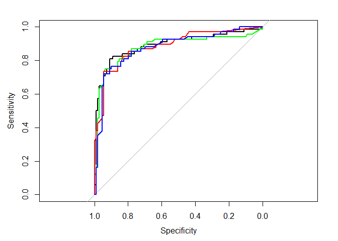 

```
## 
## Call:
## roc.default(response = test.batch$Fate, predictor = svm.probs$Survived,     levels = levels(test.batch$Fate))
## 
## Data: svm.probs$Survived in 109 controls (test.batch$Fate Perished) < 68 cases (test.batch$Fate Survived).
## Area under the curve: 0.88
```

```r
## Area under the curve: 0.8077
```


The following R script uses ``` caret``` function ``` resamples``` to collect the resampling results, then calls the  ``` dotplot``` function to create a visualization of the resampling distributions.  I'm typically not one for leaning on a single metric for important decisions, but if you have been looking for that one graph which sums up the performance of the four models, this is it.  

```r
cv.values <- resamples(list(Logit = glm.tune.5, Ada = ada.tune, 
                            RF = rf.tune, SVM = svm.tune))
dotplot(cv.values, metric = "ROC")
```

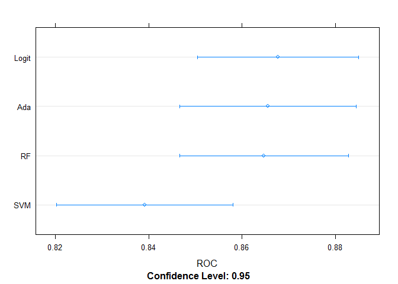 


The next graph (my last, scout's honor) compares the four models on the basis of ROC, sensitivity, and specificity.  Here, sensitivity (“Sens” on the graph) is the probability that a model will predict a Titanic passenger's death, given that the passenger actually did perish.  Think of sensitivity in this case as the true perished rate.  Specificity (“Spec”), on the other hand, is the probability that a model will predict survival, given that the passenger actually did survive.  Simply put, all four models were better at predicting passenger fatalities than survivals, and none of them are significantly better or worse than the other three. Of the four, if I *had* to pick one, I'd probably put my money on the logistic regression model.


Let me reiterate the point I made in the disclaimer, *way* up at the top of this tl;dr page:  This journey, paved with text and graphs, was never intended to reveal a path to discovery of the best model for predicting the fate of the passengers referenced in the Titanic data set.  I sought only to demonstrate use of a subset of the tools – methods and software (R in this case) –  a data scientist can employ in pursuit of a binary classification model. 

### Cast Your Votes

Given everything we've been through here, it would be a shame if we didn't submit at least one of the four models to the [Titanic competition at Kaggle](http://www.kaggle.com/c/titanic-gettingStarted).  Here is a script which munges the data Kaggle provided in their test.csv file, uses that data and the logistic regression model **glm.tune.5** to predict the survival (or not) of passengers listed in the test file, links the predictions to the PassengerId in a data frame, and writes those results to a submission-ready csv file. 

```r
# get titles
df.infer$Title <- getTitle(df.infer)

# impute missing Age values
df.infer$Title <- changeTitles(df.infer, c("Dona", "Ms"), "Mrs")
titles.na.test <- c("Master", "Mrs", "Miss", "Mr")
df.infer$Age <- imputeMedian(df.infer$Age, df.infer$Title, titles.na.test)

# consolidate titles

# same correction for Noble

df.infer$Title <- changeTitles(df.infer, c("Col", "Dr", "Rev"), "Sir")
df.infer$Title <- changeTitles(df.infer, c("Mlle", "Mme"), "Miss")
df.infer$Title <- as.factor(df.infer$Title)

# impute missing fares
df.infer$Fare[ which( df.infer$Fare == 0)] <- NA
df.infer$Fare <- imputeMedian(df.infer$Fare, df.infer$Pclass, 
                                as.numeric(levels(df.infer$Pclass)))
# add the other features
df.infer <- featureEngrg(df.infer)
```

```
## The following `from` values were not present in `x`: 1, 0
```

```r
# data prepped for casting predictions
test.keeps <- train.keeps[-1]
pred.these <- df.infer[test.keeps]

# use the logistic regression model to generate predictions
Survived <- predict(glm.tune.5, newdata = pred.these)

# try the svm model 
# Survived <- predict(svm.tune, newdata = pred.these)
# reformat predictions to 0 or 1 and link to PassengerId in a data frame
Survived <- revalue(Survived, c("Survived" = 1, "Perished" = 0))
predictions <- as.data.frame(Survived)
predictions$PassengerId <- df.infer$PassengerId

# write predictions to csv file for submission to Kaggle
write.csv(predictions[,c("PassengerId", "Survived")], 
          file="Titanic_predictions.csv", row.names=FALSE, quote=FALSE)
```

If you must know, the logistic regression model scored 0.77990 on Kaggle – roughly middle of the pack on [the leaderboard](http://www.kaggle.com/c/titanic-gettingStarted/leaderboard) (as of late January 2014).  I have submitted better scoring models; my best thus far, at 0.79426, trails just 17 percent of the 1150+ participants on the leaderboard.  

While I'm certain that I could squeeze more out of a model like Random Forest to improve my Kaggle ranking, I see better uses of my time.  The correlation between public scores and final scores at Kaggle competitions is historically poor (see [this post](http://www.rouli.net/2013/02/five-lessons-from-kaggles-event.html)).  Besides, I'd rather devote more time helping people with *today's* challenges.
